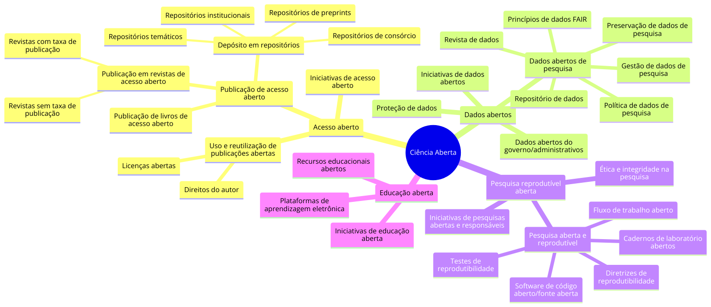

# Introdução à Ciência Aberta {#sec-intro}

 

## Objetivos de Aprendizagem

::: {.callout-tip icon="false"}
## \emojitext{🎯} Ao final deste módulo, você será capaz de:

-   Compreender o contexto histórico da crise de reprodutibilidade e o surgimento do movimento de Ciência Aberta como resposta aos desafios contemporâneos da pesquisa científica
-   Identificar as diferentes escolas de pensamento e dimensões conceituais da Ciência Aberta, distinguindo entre perspectivas macro (políticas, infraestrutura) e micro (práticas do pesquisador)
-   Reconhecer as especificidades da trajetória brasileira rumo à Ciência Aberta, incluindo marcos regulatórios, limitações atuais e correntes críticas no debate nacional
-   Compreender o espectro de reprodutibilidade como continuum que organiza práticas abertas em três dimensões (Assets, Platforms, Practices) e três níveis de integração (Data, Code, Linked)
-   Identificar os três níveis de reprodutibilidade propostos pelo workflow ARTE (mínima, adequada, completa) e suas respectivas exigências técnicas e metodológicas
-   Mapear o arsenal de ferramentas disponíveis para operacionalizar práticas de Ciência Aberta em cada nível do espectro de reprodutibilidade, reconhecendo a adoção não-linear
:::

## Contextualização

A pesquisa científica atual enfrenta vários desafios [@munafo2017]. Problemas como o pequeno tamanho da amostra, pequenos tamanhos de efeito, p-hacking (ajuste indevido de significância estatística) e HARKing (viés positivo de publicação), conflitos de interesse e a competição entre cientistas, têm sido apontados como catalizadores do que se convencionou chamar de "crise de reprodutibilidade" [@baker2016; @munafo2017].

Pesquisas apontam que mais de 70% de pesquisadores que tentaram, falharam em reproduzir os experimentos de outros cientistas, e mais da metade falhou em reproduzir seus próprios experimentos [@baker2016], com estimativa de que 85% dos esforços de pesquisas estejam sendo desperdiçados [@munafo2017], gerando custos econômicos bilionários [@freedman2015].

A despeito daqueles que advogam que não existe essa tal "crise de reprodutibilidade" na ciência [@bernard2023; @fanelli2018; @protzko2023], a grande maioria da comunidade científica concorda com sua existência e defende a melhoria da transparência, reprodutibilidade e eficiência [@baker2016].

Nesse contexto, o movimento da Ciência Aberta (CA) tem ganhado notoriedade e mudado a percepção sobre o cenário científico global [@cruwell2019]. Ele busca tornar o conhecimento científico mais acessível, transparente e colaborativo. Se apresenta como uma coleção de práticas de democratização do conhecimento e ruptura com o formato único de divulgação do conhecimento científico [@cruwell2019; @heinz2024; @munafo2017]. Ele surge do embate entre aqueles que buscam compartilhar o conhecimento e aqueles que defendem mecanismos de apropriação privada para a produção científica [@heinz2024].

A CA é um termo complexo e genérico [@vicente-saez2018], que representa diversas interpretações, e é considerada um novo modelo de divulgação e produção de resultados científicos por meio do acesso livre e irrestrito ao conhecimento [@heinz2024]. A CA não é apenas um conceito, mas uma proposta prática que influencia o ciclo de vida da pesquisa, desde a concepção até a disseminação dos resultados [@silva2019].

Existem pelo menos cinco escolas de pensamento dentro da CA. Estas escolas abrangem desde a arquitetura tecnológica necessária para suportar a ciência até a inclusão do público geral na criação de conhecimento, passando pela medição do impacto alternativo, acesso ao conhecimento como um direito humano, e a pesquisa colaborativa como inovação aberta [@silva2019].

A taxonomia proposta pela [FOSTER](https://openscience.eu/article/project/foster) (Facilitate Open Science Training for Eurpean Research), e sua releitura revisada e ampliada para o contexto latino americano por @silveira2023, tendo em vista as recomendações da @unesco2021, nos dá uma dimensão da complexidade do assunto (vide ilustração em: <https://doi.org/10.5281/zenodo.7836884>).

## Ciência Aberta no Brasil

O movimento da CA no Brasil está em uma fase transitória [@rezende2020], ainda consolidando o acesso aberto, com o governo desempenhando um papel crucial nesse processo. O Brasil tem ganhado destaque por sua abordagem única na implementação da CA. Esta abordagem é moldada por marcos regulatórios que se estendem desde o governo até as instituições e agências de financiamento. Os regulamentos brasileiros, particularmente aqueles que promovem a abertura de dados governamentais, têm um impacto direto na prática científica. Eles incentivam a transparência e facilitam o acesso a dados científicos originados de instituições públicas [@rezende2020].

A trajetória brasileira rumo à CA inicia com a abertura de dados na esfera governamental entre 2009 e 2016, evoluindo para a criação de um grupo de trabalho em 2017 pelo [Ministério da Ciência, Tecnologia, Inovações e Comunicações (MCTIC)](https://www.gov.br/mcti/pt-br) para desenvolver uma política nacional para a CA. Este esforço concentrou ênfase no reconhecimento dos dados de pesquisa como ativos de desenvolvimento científico, econômico e social, buscando facilitar seu acesso, compartilhamento e reutilização [@rezende2020].

Talvez por esse motivo, as políticas institucionais brasileiras revelam um cenário ainda muito influenciado pela "via verde" do movimento de acesso aberto, caracterizado pelo depósito de dados em repositórios digitais abertos, e que o comprometimento efetivo do Brasil com a CA ainda é incipiente. As regulamentações atuais favorecem principalmente o acesso aberto, sem abordar de maneira abrangente outros aspectos da CA [@rezende2020]. O Brasil é um dos líderes mundiais no fornecimento de acesso universal às suas pesquisas e estudos [@neto2016], com crescimento estável de sua produção científica disponível em acesso aberto, principalmente, as áreas de Agricultura e Ciência & Tecnologia [@caballero-rivero2019].

Em termos de pesquisa acadêmica sobre o tema no Brasil, os estudos são precoces e concentrados na área de Ciência da Informação [@albano2023]. A despeito da maturidade da CA no Brasil, a importância do tema, materializada na quantidade de produção acadêmica, tem aumentado vertiginosamente [@albano2023], e a dispersão de autores e respectivas instituições que publicam sobre o assunto, parece ser a situação predominante.

Apesar de importantes atores nacionais, tais como [CAPES](https://www.gov.br/capes/), [CNPq](https://www.gov.br/cnpq/) e [SciELO](https://scielo.org/), defenderem o crescimento de iniciativas de CA [@mendes-da-silva2023], o assunto no Brasil parece estar circunscrito em iniciativas de importantes periódicos nacionais sobre dados aberto, capitaneados pelas orientações da [SciELO](https://scielo.org/). Considerando o ano de 2024, não encontramos nenhuma pesquisa empírica, sobre a prática da CA no Brasil.

## Críticas brasileiras à Ciência Aberta

A literatura brasileira apresenta uma corrente crítica que questiona se a CA representa efetivamente uma democratização do conhecimento ou se pode funcionar como nova forma de apropriação e dominação de países centrais sobre os periféricos, especialmente por meio do colonialismo de dados, da dependência de infraestruturas digitais externas e da concentração de poder informacional em grandes empresas e instituições do Norte Global [@furtado2024; @kronbauer2024; @sinani2023]. Essas análises destacam riscos de extrativismo de dados, perda de soberania digital e aprofundamento de assimetrias, em um cenário no qual parte significativa dos sistemas nacionais de informação científica opera sobre plataformas controladas por corporações estrangeiras [@furtado2024; @sinani2023].

Outra vertente crítica enfatiza a mercantilização da publicação científica e o capitalismo acadêmico, apontando que modelos baseados em Article Processing Charges (APCs) podem deslocar a barreira de acesso para a barreira de publicação, penalizando pesquisadores de contextos periféricos com menor financiamento [@neubert2021; @silveira2025; @bechi2024]. Ao mesmo tempo, analisa-se a geopolítica do conhecimento e a relação da agenda de CA com lógicas neoliberais, indicando que, se implementada sem considerar as especificidades do Sul Global, a CA pode reforçar padrões epistêmicos eurocêntricos, métricas competitivas e usos privados de resultados gerados com recursos públicos [@albagli2004; @bechi2024].

Por outro lado, o debate também reconhece alternativas e resistências, como o modelo diamante de publicação predominante em parte das revistas latino-americanas, iniciativas de soberania digital e infraestruturas descentralizadas que buscam reduzir dependências estruturais [@silveira2025; @abreu2022]. Nessa perspectiva, as críticas não rejeitam a CA em si, mas reforçam a necessidade de políticas e práticas que integrem preocupações com justiça socioeconômica, fortalecimento de infraestruturas locais e um projeto de CA genuinamente emancipatório, em vez de uma nova face da dominação capitalista e colonial.

## Perspectiva da Ciência Aberta

Por prática de CA entende-se a perspectiva micro da CA, relacionadas com as terminologias e conhecimento em torno do fluxo de trabalho do gerador de conhecimento científico aberto (@fig-ca-micro), ou seja, o cientista que se propõe tornar sua pesquisa transparente, reprodutível e replicável.

[{#fig-ca-micro fig-alt="Perspectiva micro da CA" fig-align="left"}](https://doi.org/10.5281/zenodo.10835001)

Exclui-se a perspectiva macro, relacionadas com as ramificações conceituais da CA concernentes às políticas públicas, infraestrutura, envolvimento aberto de atores sociais e diálogo aberto com outros sistemas de conhecimento (@fig-ca-macro). Essa última perspectiva está fora do escopo da discussão do curso, que se concentra em algumas das dimensões da perspectiva micro, particularmente, as ferramentas disponíveis para compilação dos produtos científicos que integram a publicação científica [@unesco2021].

[{#fig-ca-macro fig-alt="Perspectiva macro da CA" fig-align="left"}](https://doi.org/10.5281/zenodo.10835001)

## Educação em Ciência Aberta

A comunidade científica e atores importantes do cenário advogam que a solução para a "crise de reprodutibilidade" passa por educar os estudantes e pesquisadores desde cedo em todas as questões da CA [@baker2023; @bezjak2018; @chopik2018; @cruwell2019; @dogucu2022; @janz2015; @mcaleer2022; @munafo2017; @toelch2018].

A referida crise não deriva de má conduta científica, mas principalmente da confusão entre replicar conclusões, replicar resultados, falta de literacia em dados, estatística, programação, lógica e método científico. Para combater essas questões é necessário investir em educação e disseminação de boas práticas de investigação para uma mudança de cultura [@baker2023; @bezjak2018; @chopik2018; @cruwell2019; @dogucu2022; @janz2015; @mcaleer2022; @munafo2017; @toelch2018].

Investir em recursos humanos, treinamento, educação, alfabetização digital, capacitação sistemática e contínua, e fomentar uma cultura de CA, têm sido apresentadas como algumas das principais medidas simultâneas para superar o cenário atual [@crrs2019; @EU2017; @unesco2021].

## Da Teoria à Prática: Implementando Ciência Aberta

Embora os princípios da CA sejam amplamente defendidos, sua implementação prática permanece um desafio significativo para pesquisadores, especialmente nas Ciências Sociais Aplicadas [@limongi2025b]. A crise de reprodutibilidade, embora catalisadora do movimento de CA, é apenas sintoma de desafios estruturais mais profundos [@cruwell2019]. Taxonomias como as de @silveira2023 e @zarghani2023 mapeiam um ecossistema complexo que vão desde infraestrutura até governança, cuja amplitude, à primeira vista, intimida o pesquisador individual e exige um recorte estratégico [@limongi2025b].

A solução para a crise e a construção de uma ciência mais transparente começam com mudanças pragmáticas, implementáveis no nível do pesquisador [@alessandroni2022; @limongi2025b]. A transição para uma ciência mais aberta inicia-se com mudanças concretas e gerenciáveis em nossos ambientes de trabalho, digitais ou não, uma abordagem *bottom-up* onde o pesquisador é protagonista [@limongi2025b]. Nessa perspectiva, o foco recai sobre a dimensão micro da CA: o fluxo de trabalho do cientista que busca tornar sua pesquisa transparente, reprodutível e replicável.

### Espectro de Reprodutibilidade

Para compreender os níveis de compromisso com práticas abertas, é útil visualizar a reprodutibilidade como um espectro contínuo, não como um estado binário. Essa perspectiva foi proposta por @zaragozi2020 e adaptada para o contexto das Ciências Sociais Aplicadas, organizando práticas de reprodutibilidade em três dimensões essenciais: **Assets** (ferramentas e dados locais), **Platforms** (serviços em nuvem para colaboração) e **Practices** (metodologias de trabalho) (@fig-spectrum-conceptual).

![Espectro de reprodutibilidade em Ciências Sociais Aplicadas: dimensões conceituais. O gradiente de cores representa níveis crescentes de compromisso com práticas abertas, organizados em três dimensões (Assets, Platforms, Practices) e três colunas que representam diferentes estágios de integração: Data (organização e compartilhamento de dados), Code (versionamento e documentação de código), e Linked (integração computacional de dados, código e narrativa). Ilustração disponível em: https://doi.org/10.5281/zenodo.17830903.](img/spectrum-conceptual.jpg){#fig-spectrum-conceptual fig-alt="Espectro conceitual de reprodutibilidade" fig-align="left"}

O espectro apresenta três colunas que representam progressão na integração: **Data** (organização e compartilhamento de dados), **Code** (versionamento e documentação de código), e **Linked** (integração computacional de dados, código e narrativa). O gradiente de cores - do vermelho (práticas básicas) ao amarelo (práticas intermediárias) e verde (práticas avançadas) - comunica visualmente que a reprodutibilidade não é um objetivo único, mas um continuum onde diferentes níveis de sofisticação tecnológica e metodológica coexistem e são válidos [@zaragozi2020].

Um aspecto crítico do espectro é que **Practices** (práticas metodológicas) alcançam tons mais intensos de verde mesmo em estágios intermediários, indicando que metodologia adequada pode ser mais determinante que sofisticação tecnológica [@zaragozi2020]. Por exemplo, metadados bem estruturados e documentação clara podem ser mais valiosos para a reprodutibilidade que código complexo sem explicação [@zaragozi2020].

### ARTE: Operacionalizando o Espectro

Neste contexto, o workflow [**ARTE** (*Article Reproducibility Template & Environment*)](https://phdpablo.github.io/article-template/) emerge como proposta pedagógica para operacionalizar o espectro de reprodutibilidade em pesquisas na área de Ciências Sociais Aplicadas [@rogers2025; @limongi2025a; @limongi2025b]. O [ARTE]((https://phdpablo.github.io/article-template/)) não impõe uma trajetória única, mas oferece um roteiro estruturado em três níveis progressivos que materializam as dimensões do espectro de reprodutibilidade.

O [ARTE](https://phdpablo.github.io/article-template/) propõe uma taxonomia de reprodutibilidade em três níveis - **mínima**, **adequada** e **completa** - que permite adoção progressiva de práticas abertas sem sobrecarregar pesquisadores iniciantes [@rogers2025]. Esta abordagem alinha-se com a recomendação pragmática de que "compartilhar algo é melhor que nada compartilhar" [@klein2018], reconhecendo que diferentes estágios de abertura são válidos e contribuem para o avanço científico [@kathawalla2021].

A reprodutibilidade **mínima** concentra-se na organização e compartilhamento de dados segundo o [TIER Protocol](https://www.projecttier.org/tier-protocol/protocol-4-0/), exigindo apenas conhecimentos de gestão de arquivos (literacia em dados) e familiaridade com plataformas como o [Open Science Framework (OSF)](https://osf.io/) [@limongi2025b]. Corresponde às zonas vermelhas e amarelas da coluna **Data** no espectro, estabelecendo a base: estrutura de pastas padronizada, metadados descritivos e licenciamento adequado.

A reprodutibilidade **adequada** adiciona controle de versão de código ([Git](https://git-scm.com/)/[GitHub](https://github.com/)) e gestão de dependências ([renv](https://rstudio.github.io/renv/) para [R](https://www.r-project.org/)/[conda](https://docs.conda.io/) para [Python](https://www.python.org/)), introduzindo a publicação de documentos dinâmicos com [Quarto](https://quarto.org/)/[RStudio](https://posit.co/products/open-source/rstudio/) [@limongi2025b]. Este nível integra as colunas **Data** e **Code** do espectro, avançando para as zonas amarelas e verdes iniciais: versionamento, documentação de código, documentos dinâmicos e controle de dependências.

A reprodutibilidade **completa** integra dados, código e narrativa em ambientes computacionais encapsulados ([Docker](https://www.docker.com/)), garantindo execução idêntica em qualquer máquina [@limongi2025b]. Representa a coluna **Linked** do espectro em sua expressão mais avançada (zonas verdes), onde documentos dinâmicos, gerenciadores de dependências e tecnologias de containerização convergem para criar artefatos científicos completamente reproduzíveis.

### Ferramentas Práticas e Adoção Incremental

A operacionalização do [ARTE](https://phdpablo.github.io/article-template/) requer ferramentas concretas em cada nível. A @fig-spectrum-tools apresenta o espectro de reprodutibilidade com ferramentas específicas recomendadas para Ciências Sociais Aplicadas, permitindo que pesquisadores identifiquem soluções práticas para cada estágio de compromisso com a CA.

{#fig-spectrum-tools fig-alt="Espectro de ferramentas para reprodutibilidade" fig-align="left"}

Na zona mínima (tons avermelhados), priorizam-se formatos de dados tabulares (CSV), APIs públicas para dados abertos, repositórios institucionais ([OSF](https://osf.io/), [Zenodo](https://zenodo.org/), [Dataverse](https://dataverse.org/), [ICPSR](https://www.icpsr.umich.edu/)) e práticas de documentação básica (metadados, licenciamento) [@rogers2025]. Estas ferramentas exigem curva de aprendizado mínima e constituem o ponto de entrada natural para pesquisadores que iniciam sua jornada em CA.

Na zona adequada (tons amarelados), introduzem-se interfaces estatísticas ([JASP](https://jasp-stats.org/), [Jamovi](https://www.jamovi.org/), [Orange](https://orangedatamining.com/), [Knime](https://www.knime.com/)), linguagens de programação ([R](https://www.r-project.org/), [Python](https://www.python.org/)), ambientes de desenvolvimento ([RStudio](https://posit.co/products/open-source/rstudio/), [Jupyter](https://jupyter.org/)), versionamento ([Git](https://git-scm.com/)), plataformas colaborativas ([GitHub](https://github.com/), [GitLab](https://about.gitlab.com/)), e gestão de dependências ([renv](https://rstudio.github.io/renv/) para R, [conda](https://docs.conda.io/) para Python) [@rogers2025]. [JASP](https://jasp-stats.org/) e [Jamovi](https://www.jamovi.org/) servem como pontes para pesquisadores acostumados a interfaces gráficas, gradualmente introduzindo conceitos de código reproduzível [@baker2023; @limongi2025b]. [Zotero](https://www.zotero.org/) complementa este ecossistema como ferramenta de gerenciamento de referências, integrando-se aos fluxos de trabalho com [RStudio](https://posit.co/products/open-source/rstudio/) para facilitar inserção de citações em documentos dinâmicos [@rogers2025].

Na zona completa (tons esverdeados), integram-se sistemas de publicação científica ([Quarto](https://quarto.org/), [RMarkdown](https://rmarkdown.rstudio.com/)), gestão avançada de ambientes ([Docker](https://www.docker.com/), [Podman](https://podman.io/)), hospedagem estática ([GitHub Pages](https://pages.github.com/), [Quarto Pub](https://quartopub.com/)), notebooks executáveis ([Binder](https://mybinder.org/)), computação em nuvem ([Posit Cloud](https://posit.cloud/), [Google Colab](https://colab.research.google.com/)), e automação de workflows [@rogers2025; @rodrigues2023]. [Docker](https://www.docker.com/) e [Project Rocker](https://rocker-project.org/) encapsulam o ambiente computacional completo, solucionando o "inferno de dependências" e garantindo reprodutibilidade de longo prazo [@moreau2023; @zandonella2022].

A flexibilidade do espectro permite **adoção não-linear**: um pesquisador pode utilizar [Git](https://git-scm.com/) e compartilhar scripts no [OSF](https://osf.io/) sem necessariamente usar [GitHub](https://github.com/), ou adotar [Quarto](https://quarto.org/) e [renv](https://rstudio.github.io/renv/) sem jamais usar [Docker](https://www.docker.com/) [@limongi2025b]. Esta característica alinha-se com a filosofia do [ARTE](https://phdpablo.github.io/article-template/) de que "o perfeito é inimigo do bom" [@klein2018] - melhor compartilhar dados organizados hoje que esperar anos para dominar containerização [@kathawalla2021].

Ambientes de computação em nuvem - [Google Colab](https://colab.research.google.com/), [Posit Cloud](https://posit.cloud/), [JupyterHub](https://jupyter.org/hub), [Binder](https://mybinder.org/), [Nextjournal](https://nextjournal.com/) e [Code Ocean](https://codeocean.com/) - abstraem a complexidade da containerização, oferecendo ambientes pré-configurados acessíveis via navegador que democratizam o acesso a ferramentas computacionais [@wiebels2021; @limongi2025b]. Estas plataformas servem diferentes pontos do espectro, desde reprodutibilidade básica (Colab) até encapsulamento completo (Code Ocean e Nextjournal) [@clyburne-sherin2019].

Para pesquisadores do ecossistema [R](https://cran.r-project.org/), o [RStudio IDE](https://posit.co/products/open-source/rstudio/) consolida-se como hub que integra estas soluções em interface única, combinando nativamente [Quarto](https://quarto.org/), [Git](https://git-scm.com/)/[GitHub](https://github.com/), [renv](https://rstudio.github.io/renv/), e [Zotero](https://www.zotero.org/) [@vuorre2018; @zandonella2022; @rodrigues2023]. Este ambiente integrado pode ser potencializado ao executar o próprio [RStudio](https://posit.co/products/open-source/rstudio/) dentro de um container [Docker](https://www.docker.com/) via [Project Rocker](https://rocker-project.org/), encapsulando todo o ambiente de desenvolvimento [@rodrigues2023].

### Perspectivas e Desafios

Embora o [ARTE](https://phdpablo.github.io/article-template/) ofereça roteiro estruturado, barreiras persistem. A falta de treinamento formal em ferramentas computacionais, a pressão por publicações rápidas, e a ausência de incentivos institucionais para práticas abertas dificultam a adoção em larga escala [@kathawalla2021; @limongi2025b]. No contexto brasileiro, onde políticas de CA ainda favorecem predominantemente o acesso aberto sem abordar outros aspectos da reprodutibilidade [@rezende2020], iniciativas educacionais como este curso tornam-se ainda mais críticas.

O movimento rumo à ciência reproduzível não requer abandonar práticas estabelecidas, mas **integrá-las progressivamente** ao workflow de pesquisa [@limongi2025b]. Como apontam @alston2021, pesquisa reproduzível "não se trata apenas de ferramentas avançadas, mas também de hábitos simples de trabalho". A jornada para a CA é contínua, construída sobre hábitos consistentes [@limongi2025b].

A CA, portanto, não é uma revolução disruptiva, mas uma **evolução metodológica** que fortalece a credibilidade científica sem comprometer a autonomia do pesquisador. O ARTE, que adotaremos transversalmente nesse curso, oferece um mapa para esta jornada, reconhecendo que diferentes trajetos são válidos desde que orientados pelos princípios de transparência, reprodutibilidade e abertura. Talvez mais importante que o produto final, seja o processo que levou ao produto final.

## Preparação para a Aula

::: callout-important
## Pré-requisitos

Este módulo é focado na apresentação e discussão de conceitos fundamentais sobre Ciência Aberta e reprodutibilidade. A aula será conduzida por meio de exposição dialogada, sem atividades práticas programadas.

**Leituras Recomendadas**

Para aprofundar sua compreensão dos temas abordados neste módulo, recomendamos a leitura da trilogia de editoriais "Open Science in Three Acts":

-   **Primeiro Ato** [@limongi2025a]: apresenta os fundamentos da Ciência Aberta, discutindo a crise de reprodutibilidade e defendendo o engajamento de orientadores e programas de pós-graduação. Disponível em: <https://doi.org/10.1590/1807-7692bar2025250079>

-   **Segundo Ato** [@limongi2025b]: aprofunda a dimensão prática, apresentando o arsenal de ferramentas e soluções para operacionalizar os princípios de transparência e compartilhamento no workflow individual do pesquisador. Disponível em: <https://doi.org/10.1590/1807-7692bar2025250116>

-   **Terceiro Ato** [@rogers2025]: apresenta o template [ARTE](https://phdpablo.github.io/article-template/) como solução pedagógica para implementação incremental de práticas reproduzíveis em pesquisas quantitativas. Disponível em: <https://doi.org/10.1590/1807-7692bar2025250162>

**Pré-requisitos Técnicos**

Embora este módulo seja teórico, os módulos seguintes do curso envolverão atividades práticas. Recomendamos que você **antecipe a instalação e configuração das ferramentas necessárias** seguindo as instruções detalhadas na seção de [**Pré-requisitos do Curso**](https://phdpablo.github.io/curso-open-science/00-prework.html)
:::

