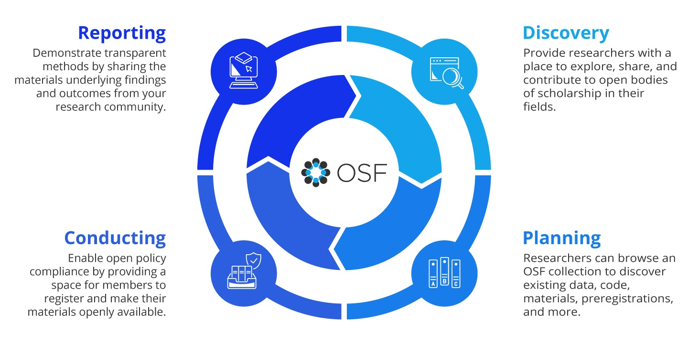
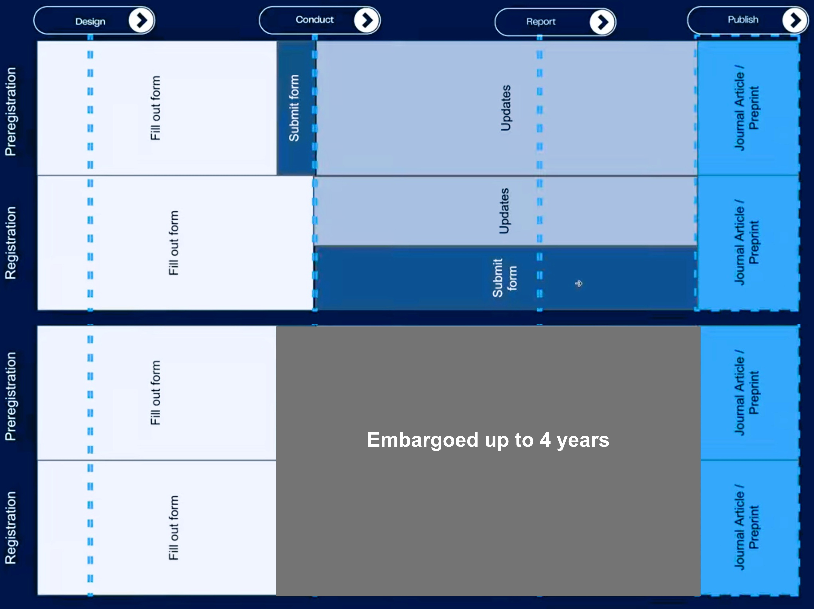

# Repositórios da Ciência Aberta {#sec-osf}

<br>

## Objetivos de Aprendizagem

::: {.callout-tip icon="false"}
## \emojitext{🎯} Ao final deste módulo, você será capaz de:

-   Criar e configurar projetos no OSF, incluindo metadados, componentes hierárquicos e integrações com serviços externos
-   Conectar o OSF a armazenamentos em nuvem (OneDrive, Google Drive), gerenciadores de referências (Zotero) e repositórios de código (GitHub)
-   Onde criar e submeter pré-registros utilizando templates apropriados ao desenho de pesquisa (OSF Preregistration, Secondary Data, Registered Reports)
-   Distinguir entre preregistration e registration, compreendendo quando aplicar cada modalidade no ciclo de pesquisa
-   Gerar DOIs para projetos e componentes, tornando materiais de pesquisa citáveis e rastreáveis permanentemente
-   Compartilhar projetos com colaboradores, gerenciar permissões e criar links anônimos para revisão por pares
-   Publicar preprints através do OSF Preprints ou serviços disciplinares (PsyArXiv, SocArXiv)
-   Avaliar quando escolher OSF versus outras plataformas
:::

## Contextualização

No contexto da CA, existem diversos repositórios disponíveis, cada um com suas funções e propósitos específicos. Esses repositórios são essenciais para promover a transparência, acessibilidade e colaboração na pesquisa científica. Eles assumem um papel muito relevante na democratização do conhecimento e na promoção da colaboração científica. Cada qual com suas particularidades, oferecem aos pesquisadores ferramentas para armazenar, compartilhar e gerenciar dados, publicações e outros materiais de pesquisa, ou se preferir, todo o ciclo de vida da pesquisa.

-   [**Zenodo**](https://www.zenodo.org): é um repositório gerido pelo CERN em colaboração com o projeto [OpenAIRE](https://www.openaire.eu/) da União Europeia. Oferece armazenamento gratuito e seguro para dados de pesquisa, com a capacidade de gerar DOIs para facilitar a citação dos dados.
-   [**Figshare**](https://www.figshare.com): é um repositório comercial que permite aos pesquisadores armazenar, compartilhar e descobrir dados de pesquisa. Oferece ferramentas para visualização de documentos, gráficos e outros tipos de dados diretamente no navegador, além de gerar DOIs para os projetos.
-   [**Mendeley Data**](https://data.mendeley.com): é um repositório de dados de pesquisa da Elsevier, permitindo o armazenamento, compartilhamento e citação de conjuntos de dados. Ele suporta uma ampla gama de tipos de dados e está integrado com a plataforma de referência Mendeley.
-   [**Harvard Dataverse**](https://dataverse.harvard.edu): é uma rede de repositórios que permite aos pesquisadores compartilhar, armazenar e citar dados de pesquisa. Ele oferece ferramentas avançadas para a gestão de dados, incluindo controle de versões e metadados ricos, essenciais para o gerenciamento do ciclo de vida da pesquisa.
-   [**arXiv**](https://arxiv.org): é um repositório de pré-impressões de artigos científicos em física, matemática, ciência da computação e outras áreas. Ele permite aos pesquisadores compartilhar seus trabalhos antes da revisão por pares, facilitando o acesso à pesquisa em estágios iniciais.
-   [**Github**](https://github.com): é uma plataforma de desenvolvimento colaborativo baseada em Git, amplamente utilizada por pesquisadores para compartilhar código, documentos e outros materiais de pesquisa. Ele oferece controle de versões, rastreamento de problemas e integração com outras ferramentas de desenvolvimento.

Além desses exemplos, poderíamos citar diversas outras soluções que cumprem papeis semelhantes ou focado em disciplinas específicas: [Databrary](https://databrary.org), [DataverseNO](https://dataverse.no), [DataONE](https://dataone.org), [DataCite](https://datacite.org), [DataHub](https://datahub.io), [DataMed](https://datamed.org), [DataShare](https://datashare.is.ed.ac.uk), [DataVerse](https://dataverse.org), [Dryad](https://datadryad.org), [EarthChem](https://earthchem.org), [EUDAT](https://eudat.eu), [European Nucleotide Archive (ENA)](https://www.ebi.ac.uk/ena/browser/home), [GenBank](https://ncbi.nlm.nih.gov/genbank), [Google Dataset Search](https://datasetsearch.research.google.com), [HathiTrust Research Center](https://hathitrust.org), [ICPSR](https://icpsr.umich.edu), [JSTOR Data for Research](https://jstor.org), [National Center for Biotechnology Information (NCBI)](https://ncbi.nlm.nih.gov), [National Institutes of Health (NIH) Data Sharing Repositories](https://nih.gov), [National Oceanographic Data Center (NODC)](https://data.noaa.gov), [PLOS ONE](https://plos.org), [PubMed Central](https://ncbi.nlm.nih.gov/pmc), [Research Data Australia](http://researchdata.ands.org.au) e [UK Data Service](https://ukdataservice.ac.uk); e em última instância, as redes sociais acadêmicas como [Academia.edu](https://academia.edu), [Google Scholar](https://scholar.google.com), [ORCID](https://orcid.org) e [ResearchGate](https://researchgate.net), também podem ser usadas para compartilhar e descobrir pesquisas.

A despeito de todas essas opções, vamos focar na plataforma [**Open Science Framework (OSF)**](https://osf.io/) para a realização do nosso curso. O **OSF** é uma plataforma de código aberto para colaboração em pesquisa, que oferece uma estrutura para conectar os fluxos de trabalho de pesquisa, desde a concepção do projeto até a publicação. O **OSF** é mantido pelo [Center for Open Science (COS)](https://www.cos.io/), uma organização sem fins lucrativos com sede nos Estados Unidos. O **OSF** é um dos principais produtos do COS e é usado por pesquisadores de todo o mundo para colaborar em projetos de pesquisa.

O **OSF** oferece uma série de recursos para ajudar os pesquisadores a gerenciar seus projetos de pesquisa, incluindo:

-   **Criar projetos de pesquisa**: organizar seus estudos, incluindo metadados, datasets, materiais de pesquisa e publicações.
-   **Carregar e publicar dados**: armazenar e compartilhar seus dados de forma segura e acessível.
-   **Colaboração em equipe**: convidar colaboradores para participar do projeto, atribuir tarefas e acompanhar o progresso.
-   **Integração com outras ferramentas**: conectar a armazenamentos nas nuvens (Box, DropBox, Google Drive e OneDrive), gerenciadores de referências (Zotero e Mendeley) e outros repositórios (Dataverse, Github, figsahre, etc).

O **OSF** tem um foco mais amplo em todo o ciclo de vida da pesquisa, desde a concepção da ideia até a publicação dos resultados (@fig-osf-researchcycle). Já algumas das soluções citadas foca principalmente no compartilhamento de dados e publicações. O **OSF** oferece ferramentas mais robustas para colaboração em equipe, como wikis, painéis de discussão e ferramentas de gerenciamento de tarefas, e principalmente, possui uma comunidade mais ativa de pesquisadores e colaboradores.

[{#fig-osf-researchcycle fig-align="center"}](https://help.osf.io/article/583-getting-to-know-the-osf-the-basics)

Para os alunos que desejam uma leitura sobre o **OSF** na prática, indicamos os artigos de @sullivan2019 e @soderberg2018. Apesar de o leitor poder encontrar *prints* das telas da plataforma desatualizadas, esses dois artigos podem ser um bom começo para entender a lógica da plataforma. E *off course*, recomendamos fortemente você dar uma olhada no [suporte do **OSF**](https://help.osf.io/article/342-getting-started-on-the-osf), onde podemos encontrar vídeos introdutórios excelentes.

::: {.callout-tip collapse="true"}
## *Duplicando um projeto*

Você sabia que é possível executar um "*duplicate*" e criar uma cópia do projeto existente ou duplicar apenas a estrutura do projeto e seus componentes de um projeto público no OSF?\vspace{0.5em}

Você que se interessa em iniciar seu próprio projeto OSF com um modelo, pode criar sua própria duplicata do projeto @olson2022 para começar!\vspace{0.5em}

Neste [projeto](https://osf.io/yaqe8/), existem templates e recursos básicos para diversos casos de uso encontrados no OSF; coordenação de equipes de pesquisa, planejamento de gerenciamento de dados, documentos reprodutíveis e até mesmo gerenciamento de cursos.
:::

## Pré-registro e Transparência Metodológica

Pré-registro documenta hipóteses e planos de análise antes da coleta de dados. A prática mitiga vieses de confirmação e decisões *post-hoc* que comprometem a validade dos resultados. Registrar decisões metodológicas antes de observar os dados torna explícito o que foi planejado versus o que foi exploratório - uma distinção que a ciência tradicional frequentemente obscurece.

O **OSF** distingue duas modalidades. *Preregistration* é criado antes da coleta ou análise de dados, quando os dados ainda não existem ou não foram observados. *Registration* documenta estudos já concluídos ou cria *snapshots* permanentes de projetos em qualquer estágio. Ambos geram registros imutáveis com timestamps, mas o timing difere. Preregistration tem maior valor para transparência metodológica porque compromete o pesquisador com um plano antes de conhecer os resultados.

:::: {.content-visible unless-format="pdf"}
::: {#fig-osf-registration}
```{=html}
<video autoplay loop muted playsinline style="max-width: 100%; height: auto;">
  <source src="resources/02-registration.webm" type="video/webm">
  Seu navegador não suporta vídeos WebM.
</video>
```

[OSF Registration](https://youtu.be/i5H9BmOF5Ng?si=euF4o1of0-YDXVnc&t=1282)
:::
::::

::: {.content-visible unless-format="html"}
{fig-align="center"}
:::

O **OSF** oferece múltiplos templates adaptados a diferentes desenhos. *OSF Preregistration* é o mais utilizado e abrangente, cobrindo hipóteses, métodos de coleta, planos de análise e critérios de exclusão. *Secondary Data Preregistration* é específico para análises de dados já coletados por outros ou por você em projetos anteriores - ele inclui questões sobre seu conhecimento prévio dos dados, tornando transparente o que já foi explorado. *Registered Report Protocol* é para submissão a periódicos que revisam protocolos antes da coleta (Stage 1), oferecendo aceitação provisória baseada na qualidade metodológica, independentemente dos resultados futuros. *Generalized Systematic Review Registration* é voltado para revisões sistemáticas e meta-análises, documentando estratégias de busca, critérios de inclusão/exclusão e métodos de síntese.

Preregistros podem ser embargados por até quatro anos, permitindo trabalhar em projetos sem exposição prematura a concorrentes. O histórico de versionamento permanece preservado mesmo durante embargo. Após publicação, o registro torna-se imutável, mas você pode vincular outputs futuros (artigos, datasets, preprints) através da funcionalidade *Connected Resources*, criando uma rede rastreável entre protocolo e produtos finais.

## Identificadores Persistentes e Rastreabilidade

DOIs tornam materiais de pesquisa citáveis permanentemente. O **OSF** gera DOIs para projetos e componentes individuais, transformando qualquer elemento do seu workflow em objeto citável com endereço permanente na web. Datasets, protocolos, códigos de análise, instrumentos - todos ganham identidade própria no registro acadêmico.

A integração com ORCiD vincula automaticamente outputs ao perfil permanente do pesquisador. Cada DOI gerado no **OSF** pode ser associado ao seu ORCiD, construindo um registro completo da sua produção que transcende afiliações institucionais. Metadados estruturados alimentam sistemas de descoberta como Google Scholar e DataCite, aumentando a visibilidade e o impacto dos materiais compartilhados.

Zenodo e OSF diferem na granularidade. Zenodo gera DOIs por versão de arquivo, permitindo citar exatamente a versão 1.2 de um dataset. OSF gera DOIs por projeto ou componente, citando o container que pode evoluir ao longo do tempo. A escolha depende das necessidades: Zenodo favorece imutabilidade estrita; OSF favorece flexibilidade e evolução do projeto com rastreamento de versões interno.

## OSF no Ecossistema de Ferramentas

Você pode configurar o **OSF** para funcionar como hub central, conectando ferramentas especializadas do seu workflow acadêmico. Ele não compete com GitHub ou Zotero - integra-se a eles. GitHub gerencia controle de versão detalhado de código-fonte, rastreando cada mudança com granularidade de linha. Zotero organiza referências bibliográficas e PDFs anotados. OSF orquestra tudo, vinculando repositórios GitHub como componentes do projeto, sincronizando bibliotecas Zotero, conectando armazenamentos em nuvem onde os dados vivem.

Essa arquitetura modular respeita especializações. Use GitHub para o que ele faz melhor: versionamento de código e colaboração via pull requests. Use Zotero para gestão bibliográfica com plugins e automações. Use OneDrive ou Google Drive para arquivos grandes que excedem limites dos repositórios especializados. O OSF une tudo sob metadados estruturados, controle de acesso unificado e DOI citável que aponta para o projeto completo.

RStudio e Quarto, que serão discutidos em módulos posteriores, produzem documentos dinâmicos onde análises, código e narrativa coexistem. Hospedar esses projetos no GitHub, vinculá-los ao OSF e depositar versões finais no Zenodo com DOI cria pipeline completo: desenvolvimento transparente (GitHub), coordenação de projeto (OSF), arquivo permanente versionado (Zenodo). Cada ferramenta contribui com sua força, nenhuma tenta fazer tudo.

## Quando Não Usar OSF

GitHub é superior para projetos centrados em código onde colaboração via *issues*, *pull requests* e integração contínua são centrais. Desenvolvedores de software preferem GitHub porque ele foi desenhado para esse workflow. O OSF conecta-se ao GitHub, mas não substitui suas funcionalidades nativas de desenvolvimento colaborativo.

arXiv permanece padrão para física, matemática e ciência da computação por razões históricas e culturais. Submeter preprints ao arXiv sinaliza conformidade com normas disciplinares. O OSF oferece OSF Preprints e serviços disciplinares (PsyArXiv, SocArXiv), mas em campos onde arXiv domina, migrar traz pouco benefício.

Repositórios disciplinares específicos são exigidos por journals ou agências de fomento em algumas áreas como genômica (GenBank) e cristalografia (Protein Data Bank). Nesses casos, depositar no repositório mandatado é obrigatório. O OSF pode complementar, vinculando o projeto ao depósito externo via metadados e *Connected Resources*, mas não substitui requisitos formais.

Dados sensíveis com restrições éticas ou legais severas podem exigir infraestrutura institucional com controles de acesso mais rígidos que os oferecidos pelo OSF. Dados de saúde identificáveis, por exemplo, frequentemente precisam permanecer em servidores certificados pela instituição. O OSF pode hospedar metadados e documentação enquanto os dados permanecem em repositório restrito.

## Preparação para a Aula

::: callout-important
## Pré-requisitos

Antes da aula síncrona, certifique-se de completar **todos** os passos abaixo. Um vídeo com instruções detalhadas está disponível na [página de pré-trabalho do curso](00-prework.html#sec-osfprework).

\vspace{10pt}

**Checklist de Preparação:**

\vspace{10pt}

1.  \emojitext{✅} Criar conta no [OSF](https://osf.io/register)
2.  \emojitext{✅} Atualizar seu perfil no OSF (Opcional)
3.  \emojitext{✅} Explorar a interface inicial do OSF e familiarizar-se com a navegação
4.  \emojitext{✅} Dar uma "olhada" nos templates de preregistro disponíveis em [OSF Registries](https://help.osf.io/article/330-welcome-to-registrations#Select-a-Registration-Template-1g4YO) (Opcional)
:::
