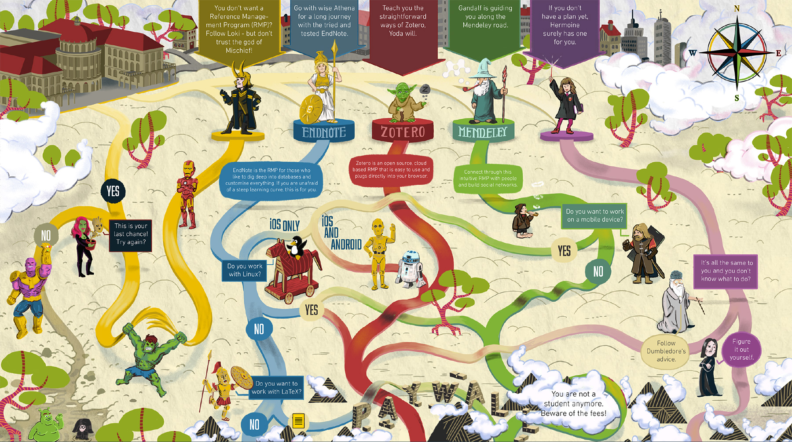
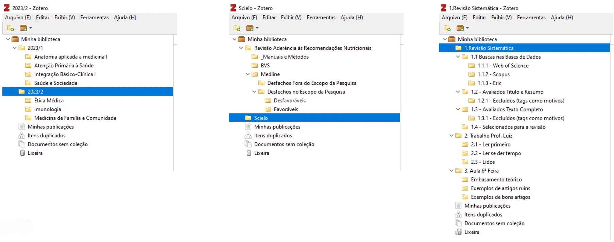

# Gerenciamento de Referências e Bibliotecas {#sec-zotero}

 

## Objetivos de Aprendizagem

::: {.callout-tip icon="false"}
## \emojitext{🎯} Ao final deste módulo, você será capaz de:

-   Configurar o Zotero 7 com plugins essenciais (Better BibTeX, Zotero Attanger etc.) e sincronização com serviços de nuvem
-   Organizar referências em coleções temáticas e utilizar tags para categorizar estágios do processo de pesquisa
-   Criar anotações e marcações em PDF como material para análises qualitativas e sínteses de literatura
-   Gerar arquivos `.bib` automatizados para integração com documentos dinâmicos (Quarto/RStudio)
-   Produzir citações em documentos Word/LibreOffice e em documentos reprodutíveis via chaves BibTeX
-   Compartilhar bibliotecas através de grupos do Zotero
-   Automatizar renomeação de PDFs e contornar limitações de armazenamento usando nuvem externa
-   Informar sobre as diversas possibilidades de integração do Zotero com ferramentas de IA (NotebookLM, Elicit, plugins de sumarização) e gestão de conhecimento (Obsidian, Notion)
:::

## Contextualização

Existem mais de 15 diferentes[^03-zotero-1] gerenciadores de referências [@proske2023]. Entre eles podemos indicar o [Citavi](https://www.citavi.com/en) e o [RefWorks](https://refworks.proquest.com/learn-more/). No entanto, os mais populares são o [EndNote](https://endnote.com/), [Mendeley](https://www.mendeley.com/reference-management/reference-manager/) e [Zotero](https://www.zotero.org/). O primeiro é proprietário e descartamos enquanto opção para nosso workflow de Open Science. Os dois últimos são excelentes opções, no entanto, o Zotero se destaca por ser código aberto (totalmente gratuíto), enquanto o Mendeley, embora gratuito, é propriedade da Elsevier, uma editora comercial. Isso significa que o Zotero não tem restrições de uso e não exige pagamento por recursos adicionais, exceto por maior armazenamento na nuvem, que inclusive, é um destaque do Mendeley (2Gb *vs* 300Mb).

[^03-zotero-1]: [Esta lista](https://en.wikipedia.org/wiki/Comparison_of_reference_management_software) no Wikipedia, que é atualizada constantemente, faz uma comparação entre eles.

[{#fig-zotilus fig-align="center"}](https://library.ethz.ch/en/news-and-courses/courses/zotero-literaturverwaltung.html)

Essa aparente desvantagem do Zotero é, na prática, contornável. O limite de 300Mb refere-se apenas à sincronização dos metadados (os dados da referência). O armazenamento dos arquivos PDF, que consomem mais espaço, pode ser direcionado para seu serviço de nuvem preferido (OneDrive, Google Drive, etc.) através de configurações e plugins específicos. Essa configuração, que será demonstrada na aula, resolve a limitação.

O Zotero tem uma comunidade ativa e fóruns de suporte, o que pode ser útil para solucionar problemas e compartilhar conhecimento com outros usuários. Como aqui valorizamos a liberdade de código aberto e uma comunidade engajada, o Zotero é nossa escolha.

Essa característica faz com que o Zotero se destaque em relação ao Mendeley, especialmente no que diz respeito ao **Ecossitema de Plugins**. O Zotero possui uma comunidade ativa de desenvolvedores e pesquisadores que criam e compartilham plugins. Esses plugins estendem as funcionalidades do Zotero, permitindo personalizações específicas e integrações com outras ferramentas [@prashantakumarbehera2023].

O plugin [Better BibTeX](https://retorque.re/zotero-better-bibtex/), por exemplo, oferece recursos avançados de exportação e formatação de bibliografias, tornando-o uma escolha popular para usuários que trabalham com LaTeX, Markdown, HTML, e outras linguagens de marcação.[^03-zotero-2] O ecossistema de plugins é tão ativo que já inclui diversas integrações com ferramentas de Inteligência Artificial (IA) para sumarização e análise de artigos (A.I.R.A., PapersGPT, ZotAi, entre outros).

[^03-zotero-2]: Outro plugin discutido é a integração com o [SciHub](https://github.com/syt2/zotero-scipdf) [@prashantakumarbehera2023]. Coloquei essa informação em nota, pois ele é questionável do ponto de vista ético, apesar de extensivamente utilizado no Brasil por estudantes de pós-graduação stricto sensu de diferentes áreas [@oddone2024]. Ou se enxergarmos o problema sob outro ponto de vista, a ampla adoção do SciHub no Brasil e em todo o mundo reflete a resposta dos cientistas ao desgastado sistema de comunicação científica mantido pelas editoras internacionais. Reforça, também, a relevância dos princípios da Ciência Aberta [@oddone2024].

A mensagem principal que pretendemos passar no curso sobre esse tópico é para você conceber os gerenciadores de referências e bibliotecas, especialmente o Zotero, no contexto do processo de pesquisa, e não apenas para citações e referências. Usuários avançados aproveitam o suporte que a maioria dos sistemas de gerenciamento de referências oferece para o ciclo da pesquisa reprodutível [@proske2023].

## O Zotero no Ciclo de Pesquisa

O Zotero pode ser integrado desde a fase de revisão sistemática ou exploratória. Você organiza referências em coleções temáticas e utiliza tags para categorizar estágios do processo. Tags como "Para Ler", "Lido", "Importante", ou "Artigo X" transformam o gerenciador em sistema de rastreamento do progresso da leitura e análise. Coleções aninhadas permitem estruturar a literatura por tema, metodologia ou relevância, criando uma arquitetura de conhecimento que cresce organicamente com a pesquisa.

[{#fig-zotcol fig-align="center"}](https://youtu.be/qTH0VWKJbS8?si=fPjMV-Xurrb0nLcD)

As notas e marcações em PDF não servem apenas para lembrar trechos. Elas alimentam análises qualitativas e sínteses de literatura. Cada anotação pode ser exportada, revisitada e reorganizada conforme o argumento do seu texto se desenvolve. A integração entre leitura, anotação e escrita torna-se dinâmica. O Zotero pode funcionar como repositório vivo de ideias, não apenas de referências bibliográficas.

Ferramentas de gestão de conhecimento como [Obsidian](https://obsidian.md/) e [Notion](https://www.notion.com/pt) podem ser integradas ao Zotero, criando redes de notas interconectadas. Suas anotações no Zotero alimentam bases de conhecimento pessoal, onde conceitos de diferentes artigos dialogam entre si. Isso transforma a revisão de literatura em processo iterativo de construção de sentido.

## Integração com Fluxos de Trabalho Reprodutíveis

O fluxo de trabalho de pesquisa reprodutível exige ferramentas que se integram com documentos dinâmicos, como Quarto e RStudio. As citações são gerenciadas por chaves BibTeX, conceito que será central na aula. O plugin [Better BibTeX](https://retorque.re/zotero-better-bibtex/), como já comentado, viabiliza essa integração de forma transparente.

O [Better BibTeX](https://retorque.re/zotero-better-bibtex/) permite criar e atualizar automaticamente arquivos `.bib` que se sincronizam com seus documentos dinâmicos. Você adiciona uma referência no Zotero, e o arquivo `.bib` reflete a mudança instantaneamente. Trabalho manual é eliminado. A gestão de referências e a escrita do manuscrito acontecem em paralelo, sem retrabalho entre coleta de literatura e produção de texto.

Manter seu arquivo `.bib` no GitHub junto com seus scripts garante que colegas possam reproduzir exatamente as mesmas citações. Versionamento de referências torna-se parte do controle de versão do projeto. Quando você compartilha o repositório, compartilha também a biblioteca bibliográfica exata que usou - rastreabilidade completa da cadeia de conhecimento.

Grupos do Zotero permitem compartilhar bibliotecas completas com equipes de pesquisa. Colaboração e transparência se expandem: todos os membros do grupo acessam as mesmas referências, anotações e anexos. Mudanças feitas por um membro sincronizam automaticamente com os demais. Projetos colaborativos ganham uma base bibliográfica unificada.

Gerenciadores preservam DOIs, abstracts e metadados que facilitam a citação correta e rastreabilidade das fontes. Metadados completos permitem que outros pesquisadores localizem rapidamente os materiais citados. Isso é requisito para pesquisa aberta e transparente - não basta citar, é preciso facilitar o acesso à fonte original.

## IA e Descoberta de Literatura

Fluxos de trabalho baseados em RAGs (Retrieval-Augmented Generation) com LLMs locais ou ferramentas como [PapersGPT](https://www.papersgpt.com/) podem ser alimentados diretamente pela sua biblioteca Zotero. RAGs na nuvem, como o [NotebookLM](https://notebooklm.google.com/) do Google, também são mais facilmente acionados com a organização eficiente das coleções/pastas do Zotero. Você constrói assistentes de pesquisa personalizados que conhecem profundamente sua literatura, respondem perguntas contextualizadas e sugerem conexões entre artigos.

Plataformas de descoberta de literatura assistida por IA, como [ResearchRabbit](https://www.researchrabbit.ai/), [Elicit](https://elicit.com/) e [SciSpace](https://scispace.com/), complementam o Zotero. [ResearchRabbit](https://www.researchrabbit.ai/) descobre conexões importantes entre a literatura; [Elicit](https://elicit.com/) automatiza revisões de literatura a partir de perguntas de pesquisa; [SciSpace](https://scispace.com/) oferece explicações contextuais de artigos complexos. Essas ferramentas não substituem a leitura crítica, mas aceleram a triagem inicial e a identificação de estudos relevantes. Integradas ao Zotero, formam um ecossistema de pesquisa potencializado por IA.

## Indo Além das Funcionalidades Básicas

Atualmente, gerenciadores de referências oferecem funcionalidades que incluem:

-   Recursos para coletar referências com textos completos e organizá-las em pastas e/ou (sub)coleções;

-   Marcar entradas de referência, fazer anotações e destacar o texto completo por meio de visualizadores de PDF integrados;

-   Citar referências em diferentes estilos de citação por meio de complementos para software de processamento de texto ou criando e atualizando automaticamente arquivos `.bib` para outras linguagens de marcação;

-   Sincronizar referências entre o aplicativo de desktop e a versão móvel, bem como entre diferentes computadores; e

-   Compartilhar referências [@proske2023]

Mas o Zotero permite ir além. Plugins como Zotero Attanger automatizam a renomeação e o armazenamento de PDFs. Você define padrões de nomenclatura - por exemplo, "Autor_Ano_Título" - e o plugin renomeia todos os arquivos de forma consistente. PDFs podem ser organizados em pastas externas no OneDrive, Google Drive ou Dropbox, sincronizando automaticamente entre dispositivos e contornando a limitação de armazenamento oficial do Zotero nas nuvens.

Essa automação transforma a desorganização de centenas de PDFs mal nomeados em biblioteca estruturada. Arquivos tornam-se localizáveis por nome, navegáveis por pastas temáticas, e acessíveis em qualquer dispositivo conectado à sua nuvem. A organização deixa de ser tarefa manual e passa a ser processo sistemático.

A integração entre Zotero e ferramentas de gestão de conhecimento cria camadas adicionais de valor. O [Obsidian](https://obsidian.md/), por exemplo, pode importar metadados e notas do Zotero, permitindo que você construa redes de conceitos interligados. Cada artigo torna-se nó em uma rede maior de ideias, conectado a outros artigos, a conceitos teóricos e a seus próprios insights. O [Notion](https://www.notion.com/pt) oferece alternativa visual, organizando referências em bancos de dados relacionais que você personaliza conforme a necessidade do projeto.

Um conteúdo básico é abordado em detalhes no trabalho de @thomas2023, e veremos algumas dessas funcionalidades na aula. No entanto, daremos ênfase em outras funcionalidades do Zotero 7, especialmente sua integração no workflow reprodutível, por exemplo, com o RStudio/Quarto para citações/referências em documentos dinâmicos.

## Preparação para a Aula

::: callout-important
## Pré-requisitos

Antes da aula síncrona, certifique-se de completar **todos** os passos abaixo. Um vídeo com instruções detalhadas está disponível na [página de pré-trabalho do curso](00-prework.html#sec-zoteroprework).

\vspace{10pt}

**Checklist de Preparação:**

\vspace{10pt}

1.  \emojitext{✅} Realizar o cadastro no [Zotero.org](https://www.zotero.org/user/register)
2.  \emojitext{✅} Innstalar o [software Zotero](https://www.zotero.org/download/) no seu computador
3.  \emojitext{✅} Instalar o [Zotero Connector](https://www.zotero.org/download/) no seu navegador (Chrome, Firefox, Edge ou Safari)
4.  \emojitext{✅} Configurar a sincronização entre instalação local e nuvem Zotero
5.  \emojitext{✅} Instalar o ["Add-on Market for Zotero"](https://github.com/syt2/zotero-addons) (gerenciador de plugins)
6.  \emojitext{✅} Instalar o estilo de citação [Better BibTeX](https://retorque.re/zotero-better-bibtex/citing/migrating/)
:::
