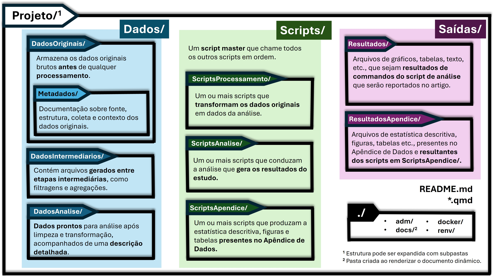
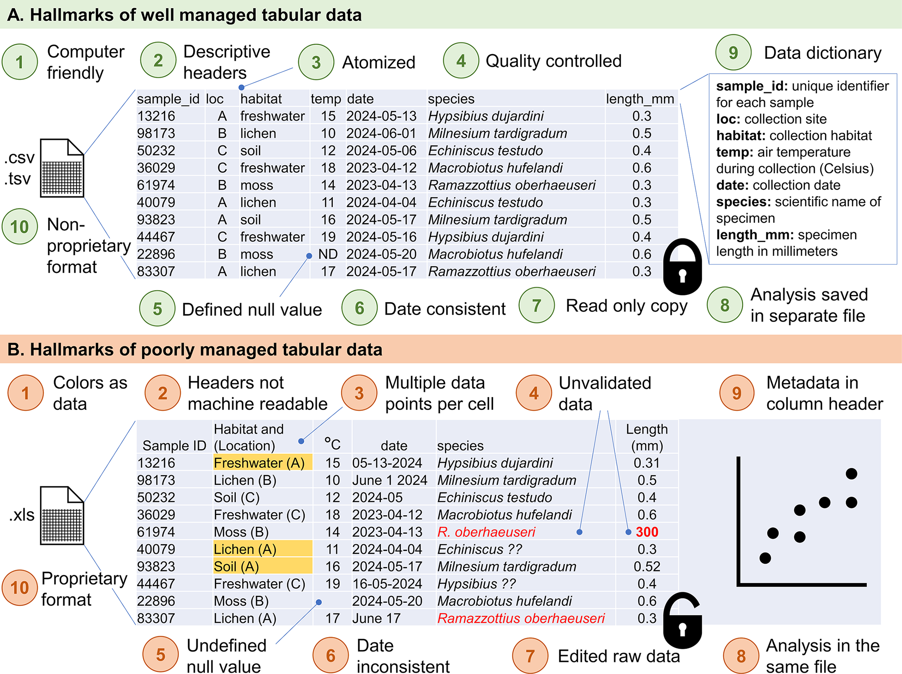

# Organização de Projetos {#sec-project}

 

## Objetivos de Aprendizagem

::: {.callout-tip icon="false"}
## \emojitext{🎯} Ao final deste módulo, você será capaz de:

-   Compreender a importância da organização padronizada de projetos de pesquisa no contexto da Ciência Aberta
-   Reconhecer os seis domínios de boas práticas propostos por @wilson2017 para pesquisa computacional reprodutível
-   Identificar as principais barreiras à reprodutibilidade em projetos de pesquisa
-   Aplicar princípios de gerenciamento de dados, incluindo separação entre dados brutos e processados
-   Estruturar projetos seguindo protocolos (templates) tal como o [ARTE](https://github.com/phdpablo/article-template) para uma reprodutibilidade adequada [@rogers2025]
-   Adotar práticas de nomenclatura consistente para arquivos e pastas
-   Reconhecer o papel do controle de versão e documentação no ciclo de vida da pesquisa
-   Avaliar alternativas de ferramentas e práticas para diferentes níveis de reprodutibilidade
:::

## Contextualização

Essa seção é o elo entre as seções anteriores e as próximas. Aqui, você vai receber algumas dicas de como organizar seus dados, pasta e scripts em um projeto de pesquisa. Talvez você se pergunte: porque eu preciso aprender a organizar meus arquivos e pasta? Já faço isso, do meu jeito, há anos, e nunca tive problemas em entender o que eu faço!

A resposta é simples: não trata somente de você entender e achar que o produto final da sua pesquisa (o artigo) seja suficiente. No contexto da Ciência Aberta (CA) o processo da análise, materiais e métodos, e que outros pesquisadores possam reproduzir seus resultados, são tão importantes quanto o produto final. Nesse sentido, deve haver uma padronização mínima de organização de arquivos, pastas e scripts para que outros pesquisadores possam entender e reproduzir seus achados.

Você pode compartilhar uma pasta compilada da sua pesquisa, via Google Drive ou OneDrive, no seu projeto do Open [Science Framework (OSF)](https://osf.io/), ou ainda publicar uma página no [Github](https://github.com/), mas se a organização dos arquivos não seguir alguma lógica compreensível, de nada adianta compartilhar. É como disponibilizar um caderno com letra ilegível — o registro existe, mas será inacessível para terceiros e, possivelmente, você mesmo no futuro.

O texto desta seção é fundamentado nas "boas práticas" propostas por @wilson2017. Esse trabalho, implementado em 2024, no contexto do [Software Carpentry e Data Carpentry](https://carpentries-lab.github.io/good-enough-practices/), estabeleceu um conjunto mínimo de práticas essenciais para pesquisa computacional reprodutível. Esse conjunto de práticas agrega o ferramental necessário para uma reprodutibilidade adequado, conforme espectro delineado por @rogers2025.

A filosofia subjacente a esse framework é pragmática: as práticas propostas não visam a perfeição absoluta, mas sim um equilíbrio viável entre rigor metodológico e aplicabilidade prática [@rogers2025]. São práticas "boas o suficiente" (*good enough*) para tornarem a pesquisa significativamente mais reprodutível sem exigirem expertise avançada em engenharia de software [@wilson2017]. O objetivo é que qualquer pesquisador, independentemente de sua formação técnica, possa implementá-las gradualmente em seus projetos.

@wilson2017 organizam suas recomendações em seis domínios fundamentais e na aula presencial, exploraremos cada um desses domínios em detalhes, compreendendo como eles se articulam para formar um fluxo de trabalho coerente e adequadamente reprodutível [@rogers2025]. Por ora, apresentaremos uma visão geral dessas práticas, destacando seus princípios centrais e justificativas metodológicas.

## Gerenciamento de Dados

O gerenciamento adequado de dados parte de um princípio fundamental: dados brutos são imutáveis. Uma vez coletados, os dados originais devem ser preservados intactos, sem qualquer modificação. Essa regra, aparentemente simples, é violada com frequência - seja pela tentação de "corrigir um valor manualmente", seja pela ausência de separação física entre dados originais e processados.

A prática recomendada consiste em armazenar dados brutos em um diretório específico, idealmente configurado como somente leitura (*read-only*). Todas as transformações - limpeza, recodificação, cálculo de variáveis derivadas - devem ser realizadas por meio de scripts, gerando novos arquivos de dados processados. Essa separação não apenas previne perda acidental de informação, mas torna explícita a distinção entre "fatos" (dados coletados) e "interpretações" (dados transformados).

Complementarmente, @wickham2014 formalizou o conceito de *Tidy Data* - uma estrutura de organização tabular onde cada variável forma uma coluna, cada observação forma uma linha, e cada tipo de unidade observacional forma uma tabela separada. Embora possa parecer uma convenção trivial, essa estrutura resolve inúmeros problemas práticos de análise e integra-se naturalmente com ferramentas modernas de ciência de dados [@wickham2023]. A conversão entre formatos *wide* e *long* não é mera reformatação, mas uma reorganização conceitual que facilita ou dificulta determinadas operações analíticas [@wickham2023].

Outro aspecto crucial é a preferência por formatos de arquivo abertos e não-proprietários. Arquivos CSV, JSON ou TSV garantem interoperabilidade (podem ser lidos por múltiplas ferramentas), longevidade (independem de software específico) e auditabilidade (podem ser inspecionados em editores de texto simples) [@weidmann2023]. Formatos proprietários como XLS ou arquivos SPSS, embora convenientes no curto prazo, criam dependências tecnológicas que comprometem o acesso futuro aos dados.

## Código e Software

Na pesquisa computacional contemporânea, o código não é uma ferramenta auxiliar - ele é a especificação precisa do método. Enquanto um artigo pode descrever genericamente "realizamos regressão logística controlando por variáveis demográficas", o código especifica exatamente qual implementação foi usada, quais parâmetros foram configurados, quais transformações prévias foram aplicadas. Portanto, a legibilidade do código é, fundamentalmente, um requisito metodológico [@pruim2023].

A adoção de *style guides* - convenções de estilo de código como o [Tidyverse Style Guide](https://style.tidyverse.org/) - representa uma maturidade da computação científica como disciplina, com suas próprias normas [@pruim2023]. Assim como convenções de citação bibliográfica facilitam a navegação em textos acadêmicos, *style guides* tornam o código previsível e compreensível. Nomenclaturas descritivas (`participant_age` em vez de `x`), uso consistente de espaçamento e indentação, e estruturas organizacionais padronizadas não são "perfeccionismo", mas práticas de comunicação eficaz [@pruim2023].

A modularização de análises complexas em scripts separados é outra prática essencial. Em vez de um único script de 2000 linhas, análises devem ser decompostas em unidades funcionais: um script para importação de dados brutos, outro para limpeza, outro para análises exploratórias, outro para modelagem estatística. Cada módulo torna-se testável independentemente, reutilizável em outros projetos, e processado em paralelo em contextos colaborativos.

## Colaboração

Projetos de pesquisa são, crescentemente, empreendimentos colaborativos - seja entre coautores, seja entre o pesquisador presente e seu "eu futuro" (que terá esquecido detalhes após alguns meses). A colaboração efetiva exige documentação que torne projetos autossuficientes, reduzindo dependência de conhecimento tácito.

O arquivo `README.md` funciona como o "cartão de visitas" do projeto [@zandonella2022]. Deve responder perguntas básicas: O que é este projeto? Qual o objetivo da pesquisa? Como os arquivos estão organizados? Como reproduzir as análises? Quem contatar para dúvidas? Um README bem escrito permite que qualquer pessoa - incluindo revisores de periódicos, colaboradores futuros, ou o próprio autor após um tempo - compreenda rapidamente a estrutura e propósito do projeto. Caso haja necessidade, pode-se cogitar um detalhamento mais apurado através de arquivos `README.md`'s por subdiretórios, como proposto pelo [Protocolo TIER 4.0](https://www.projecttier.org/tier-protocol/protocol-4-0/).

Além da documentação narrativa, é essencial explicitar questões legais e de atribuição. Um arquivo `LICENSE` define como o trabalho pode ser usado (por exemplo, licenças MIT, GPL, ou Creative Commons), enquanto um arquivo `CITATION` especifica como o trabalho deve ser creditado.

A documentação técnica do ambiente computacional também é fundamental. Listar explicitamente as versões de software, pacotes e sistema operacional utilizados permite que outros reproduzam o ambiente exato onde as análises foram executadas. Ferramentas como `sessionInfo()` no R ou `pip freeze` no Python automatizam essa documentação, capturando instantâneos do ambiente computacional.

## Organização de Projetos

Estruturas de pastas padronizadas desempenham papel análogo às convenções de estrutura de artigos científicos. Assim como leitores esperam encontrar Introdução, Métodos e Resultados em seções específicas, usuários de projetos de pesquisa beneficiam-se de estruturas previsíveis que facilitam navegação cognitiva.

Uma estrutura mínima recomendada inclui:

-   Um diretório `Data/` subdividido em `InputData/` (dados originais, imutáveis) e `AnalysisData/` (dados transformados, gerados por scripts).
-   Um diretório `Scripts/` contendo todo o código de análise.
-   Um diretório `Results/` ou `Output/` para produtos das análises (tabelas, gráficos).
-   A raiz do projeto com os manuscritos e relatórios ou num diretório `Doc/`.
-   Um arquivo `README.md` na raiz do projeto.

Protocolos mais formais, como o [**TIER 4.0** (*Teaching Integrity in Empirical Research*)](https://www.projecttier.org/tier-protocol/protocol-4-0/), detalham estruturas mais granulares, especificando inclusive separação entre scripts de processamento de dados e scripts de análise estatística, ou a inclusão de diretórios específicos para metadados. O [Protocolo TIER](https://www.projecttier.org/tier-protocol/protocol-4-0/), originalmente desenvolvido no contexto da economia, estabelece quatro princípios fundamentais para reprodutibilidade: *sufficiency* (suficiência de informação), *soup-to-nuts* (completude do início ao fim), *portability* (portabilidade entre sistemas), e *(almost) one-click reproducibility* (reprodução quase automática) [@domingos2021].

Esses protocolos não devem ser entendidos como prescrições rígidas, mas como *templates* adaptáveis a contextos disciplinares e necessidades específicas de cada projeto. Nesse sentido, implementações práticas como o [**ARTE** (*Article Reproducibility Template & Envionment*)](https://github.com/phdpablo/article-template) [@rogers2025] traduzem os princípios do TIER 4.0 para o ecossistema específico de ferramentas R/Quarto (@fig-arte-folders). O [**ARTE**](https://phdpablo.github.io/article-template/) oferece uma estrutura pronta de pastas, scripts iniciais e documentação modelo que operacionalizam as boas práticas discutidas por @limongi2025a e @limongi2025b, facilitando sua adoção por pesquisadores que trabalham com essas ferramentas. Ao longo do curso, exploraremos como o [**ARTE**](https://phdpablo.github.io/article-template/) [@rogers2025] materializa alguns dos conceitos desse módulo (reprodutibilidade adequada) e ajuda a implementar uma reprodutibilidade máxima para seus projetos.

[{#fig-arte-folders}](https://doi.org/10.5281/zenodo.16748763)

A nomenclatura consistente de arquivos complementa a organização de pastas. Convenções úteis incluem: uso de prefixos numéricos para indicar ordem de execução (`01-import.R`, `02-clean.R`) [@wickham2023], datas no formato ISO (`YYYY-MM-DD`) para ordenação cronológica automática, nomes descritivos em vez de genéricos (`clean-survey-data.R` em vez de `script2.R`), e evitação de espaços ou caracteres especiais que causam problemas em linha de comando [@weidmann2023].

## Controle de Mudanças

Pesquisa é processo iterativo. Análises são refinadas, dados são atualizados, erros são corrigidos, novos testes são explorados. Sem um sistema de controle de versão, essas iterações geram proliferação caótica de arquivos (`analise_final.R`, `analise_final2.R`, `analise_final_FINAL_revisado.R`) e perda de rastreabilidade sobre o que mudou, quando e por quê.

Sistemas de controle de versão como [Git](05-git.html), que veremos no próximo módulo, funcionam como um "caderno de laboratório digital", registrando não apenas o estado atual do projeto, mas todo seu histórico de desenvolvimento [@vuorre2018]. Cada *commit* (registro de mudança) captura: o que mudou (diferenças linha por linha), quando mudou (timestamp), quem mudou (autoria) e por que mudou (mensagem descritiva). Essa "memória" permite reversão de erros, compreensão de decisões passadas e atribuição precisa de crédito em colaborações [@gilroy2019].

Práticas essenciais incluem realizar commits frequentes e focados (mudanças pequenas e logicamente coesas), escrever mensagens descritivas ("Adiciona análise de robustez ao modelo 3" em vez de "update"), e usar *branches* (ramificações) para experimentar abordagens alternativas sem comprometer a versão estável do projeto [@bryan2018].

É importante distinguir controle de versão de backup e arquivamento [@wilson2017]. Backup (cópias redundantes em Google Drive, Dropbox) protege contra perda física de dados. Controle de versão registra histórico de mudanças. Arquivamento de longo prazo (repositórios como Zenodo ou OSF) preserva versões específicas com identificadores persistentes (DOIs) para citação. Essas três práticas são complementares, não substitutas.

## Redação de Manuscritos

A integração entre análise e redação culmina num fluxo de trabalho reprodutível. Abordagens tradicionais - executar análises em software estatístico, copiar manualmente resultados para processador de texto - introduzem múltiplos pontos de falha: erros de transcrição, dessincronia quando análises são refeitas, e falta de transparência sobre a origem exata de cada número reportado [@wilson2017].

Documentos dinâmicos (RMarkdown, Quarto, Jupyter Notebooks) implementam o conceito de *literate programming* [@rodrigues2023; @pruim2023]: intercalar código executável e narrativa em um documento único [@zandonella2022]. Tabelas e gráficos são gerados automaticamente a partir dos dados, garantindo consistência perfeita entre análise e relatório. Quando dados ou código mudam, o documento inteiro pode ser regenerado, propagando automaticamente todas as atualizações [@zandonella2022].

Além da eliminação de erros, essa abordagem torna explícita a conexão entre afirmações e evidências. Cada estatística reportada pode ser rastreada até o código exato que a produziu, permitindo verificação e crítica metodológica em nível de detalhe antes impossível.

## Começando de Onde Você Está

A transição para essas práticas não precisa ser abrupta ou completa. @alessandroni2022 enfatizam a adoção incremental: implemente algumas práticas no projeto atual, adicione outras no próximo, e assim progressivamente. Um projeto 50% reprodutível é infinitamente superior a 0% - a perfeição não deve paralisar o progresso.

Para pesquisadores que não vão adotar as ferramentas discutidas nesse curso imediatamente, existem alternativas intermediárias [@limongi2025b].

-   Ferramentas como [JASP](https://jasp-stats.org/) e [jamovi](https://www.jamovi.org/) oferecem interfaces gráficas, *point-and-click*, para análises estatísticas, que registram as seleções metodológicas com os dados aclopados, e podem ser uma solução inicial para um worflow reprodutível [@baker2023].
-   Se adicionar o [OpenRefine](https://openrefine.org/) ao fluxo, a limpeza visual de dados tabulares com log automático das transformações, oferecerá mais transparência às análises [@li2021].
-   [KNIME](https://www.knime.com/) e [Orange](https://orangedatamining.com/) possibilitam construção de pipelines analíticos por meio de diagramas de fluxo, exportáveis para documentação, que também aliadas ao [OpenRefine](https://openrefine.org/), podem tornar pesquisas baseadas em machine learning mais reprodutíveis.

Mesmo em Excel - ferramenta frequentemente criticada mas amplamente utilizada - é possível adotar práticas mais rigorosas. @broman2018 e @hertz2024 estabeleceram diretrizes específicas: uma tabela retangular por aba, cabeçalhos apenas na primeira linha, sem células mescladas, e uso de validação de entrada para prevenir erros, são algumas das principais (@fig-spreadsheet). Essas práticas, embora não alcancem a reprodutibilidade total de scripts, representam alguma melhoria sobre usos sem padronização de planilhas.

[{#fig-spreadsheet}](https://doi.org/10.1371/journal.pcbi.1012604.g001)

Se só for possível adotar três práticas inicialmente, priorize: (1) nunca modificar dados brutos diretamente - sempre criar cópias para transformação; (2) documentar minimamente o que foi feito - um README básico é melhor que nenhum; (3) usar nomenclatura consistente e descritiva para arquivos e pastas. Essas três práticas já colocam o projeto em patamar superior de organização e reprodutibilidade.

## Considerações Finais

As práticas discutidas nesta seção não são imposições externas, mas ferramentas de autodefesa do pesquisador. Protegem contra o próprio esquecimento futuro, contra exigências imprevistas de revisores solicitando dados e código, contra perda de trabalho por problemas técnicos. O investimento inicial em organização retorna dividendos progressivos: redução de erros e retrabalho no curto prazo, colaboração facilitada no médio prazo, e construção de um corpus de trabalho auditável e extensível no longo prazo [@wilson2017].

A mensagem central é otimista: melhorias são possíveis e acessíveis. Não requerem expertise técnica extraordinária, mas compromisso com práticas sistemáticas [@baker2023]. Na aula presencial, detalharemos como essas práticas se concretizam em ferramentas, templates e fluxos de trabalho específicos, sempre fornecendo referências para aprofundamento posterior.

## Preparação para a Aula

::: callout-important
## Pré-requisitos

Para melhor aproveitamento da aula, recomendamos que você realize os seguintes preparativos:

\vspace{10pt}

**1. Baixar o Template ARTE**

\vspace{10pt}

O [**ARTE** (*Article Reproducibility Template & Envionment*)](https://github.com/phdpablo/article-template/) é um template de projeto que implementa as práticas discutidas neste módulo. Durante o curso, utilizaremos esse template como exemplo prático de estrutura reprodutível.

\vspace{10pt}

**Como baixar**:

\vspace{10pt}

1.  \emojitext{✅} Acesse o repositório oficial: <https://github.com/phdpablo/article-template/>
2.  \emojitext{✅} Clique no botão verde `Code` (no canto superior direito) e selecione `Download ZIP`
3.  \emojitext{✅} Extraia o arquivo ZIP em uma pasta de fácil acesso no seu computador.
4.  \emojitext{✅} Familiarize-se com a estrutura de pastas navegando pelos diretórios e lendo os arquivos `README` em cada subpasta.

\vspace{10pt}

**2. Tidyverse Style Guide**

\vspace{10pt}

Se familiarize com as convenções do [Tidyverse Style Guide](https://style.tidyverse.org/), pelo menos àquelas concernentes para análises estatísticas. Para direcionar sua leitura, preparamos uma [**CheatSheet**](/resources/04-tidyverse_cheatsheet.html) que resume a prática diária de um analista/cientista de dados típico. Apesar de algumas orientações serem as mesmas, excluímos dessa [**CheatSheet**](/resources/04-tidyverse_cheatsheet.html) o tópico relacionado com o desenvolvimento de pacotes.

\vspace{10pt}

5.  \emojitext{✅} Dê uma olhada na [**CheatSheet**](/resources/04-tidyverse_cheatsheet.html)
:::
