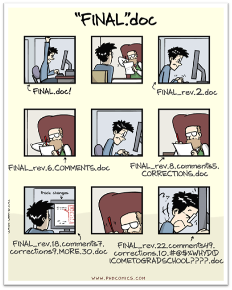
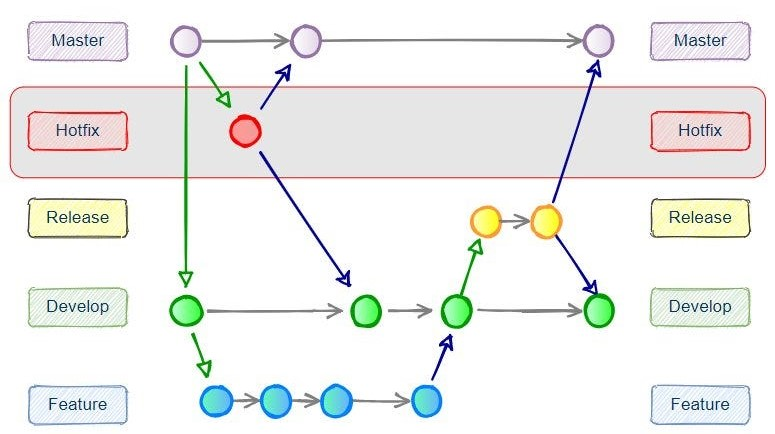

# Controle de versão {#sec-git}

 

## Objetivos de Aprendizagem

::: {.callout-tip icon="false"}
## \emojitext{🎯} Ao final deste módulo, você será capaz de:

-   Compreender a importância de sistemas de controle de versão robustos no contexto da Ciência Aberta
-   Distinguir Git (sistema de controle de versão distribuído) de GitHub (plataforma colaborativa baseada em Git)
-   Reconhecer limitações de ferramentas simples de versionamento (processadores de texto, armazenamento em nuvem) para pesquisa reprodutível
-   Identificar cenários apropriados para diferentes workflows: Git Workflow Simplificado versus Trunk-Based Development
-   Configurar repositórios locais e remotos para projetos de pesquisa
-   Realizar operações básicas de controle de versão: commits, branches, push, pull
-   Integrar Git/GitHub com RStudio para fluxo de trabalho reprodutível
-   Avaliar quando manter projetos locais versus quando sincronizar com repositórios remotos públicos
:::

## Contextualização

Você em algum grau utiliza um sistema para versionar seu trabalho. Seja ele um simples `Ctrl + Z` ou `Cmd + Z` para desfazer a última ação, ou sistemas mais elaborados, como i) o controle de alterações do seu processador de texto ou ii) o histórico de versões do seu aplicativo de armazenamento nas nuvens (`OneDrive`, `Google Drive` ou `Dropbox`), você já está familiarizado com a ideia de controle de versão. Qual estudante ou pesquisador nunca se deparou com uma situação parecida da @fig-funny-git?

[{#fig-funny-git fig-alt="Situação engraçada de versionamento" fig-align="center"}](https://phdcomics.com/comics/archive.php?comicid=1531)

No entanto, essas soluções simples são limitadas e inadequadas para gerenciar projetos de pesquisa — complexos ou simples — pois no contexto da CA, falham nos quesitos de reprodutibilidade e transparência. Para superar essas limitações, é necessário um sistema de controle de versão (VCS) mais robusto, como o Git. O Git é um VCS distribuído que armazena o histórico completo de alterações em repositórios locais e remotos, permitindo que você controle versões de seus arquivos e compartilhe-os com outras pessoas. Amplamente utilizado em projetos de desenvolvimento de software, o Git também é uma ferramenta valiosa para pesquisadores que desejam gerenciar e compartilhar seus ativos de pesquisa de forma transparente e rastreável [@vuorre2018; @gilroy2019; @bryan2018; @braga2023a].

A [literatura sobre controle de versão](https://git-scm.com/book/en/v2), especialmente Git e Github, é "farta". Tanto em inglês como em português. Uma pesquisa simples vai achar muitas referências a blogs e textos de profissionais especializados, inclusive, [para os nossos fins](https://happygitwithr.com/). No Youtube existem muitos vídeos sobre o tema. Seja o que escrevêssemos por aqui, seria de pouca contribuição adicional. Dessa forma, buscamos contextualizar o versionamento de arquivos num empreendimento de pesquisa de nosso dia a dia: um pesquisador com viés quantitativo, envolvido em pesquisas com pouca colaboração, mas que encontrou no controle de versão uma solução singular para diversas demandas preconizadas pela CA.

## Por Que Ferramentas Simples Não Bastam

Controles de versionamento mais simples, como os oferecidos por processadores de texto e soluções de armazenamento em nuvem, são insuficientes para workflows de pesquisa empírica no contexto da CA. Em projetos que envolvem múltiplos colaboradores, ferramentas simples dificultam o rastreamento e a fusão de contribuições de vários pesquisadores. O Git, por outro lado, oferece gerenciamento eficientes de branches e fusão de código, permitindo colaboração mais organizada [@vuorre2018; @braga2023a].

Processadores de texto e armazenamento em nuvem oferecem histórico de versões limitado e pouco detalhado. Em contraste, o Git permite rastreamento minucioso de cada alteração, incluindo autor e propósito de cada mudança, facilitando auditorias e revisões [@scroggie2023; @weberpals2024]. Pesquisas empíricas frequentemente envolvem scripts de análise e grandes volumes de dados que necessitam de versionamento adequado. Ferramentas simples não são otimizadas para esses tipos de arquivos, enquanto o Git gerencia código e dados de maneira eficiente, garantindo integridade e reprodutibilidade das análises [@vuorre2018; @weberpals2024].

Em ambientes de CA, automatizar testes e validações é crucial para garantir qualidade e reprodutibilidade dos resultados. Soluções como GitHub Actions permitem implementação de pipelines de integração contínua (CI), automatizando testes e outras tarefas - algo impossível com controles de versão simples [@gilroy2019]. O Git e o GitHub incentivam documentação detalhada através de commit messages e issues, promovendo transparência e compreensão do progresso e decisões do projeto [@scroggie2023; @braga2023a]. Ferramentas simples de versionamento não oferecem mecanismos equivalentes para documentar o processo de desenvolvimento de forma estruturada.

Em projetos complexos, conflitos de versão são inevitáveis. Sistemas simples podem não oferecer ferramentas adequadas para resolver conflitos de maneira eficiente. O Git proporciona ferramentas avançadas de merge e resolução de conflitos, minimizando risco de perda de dados ou inconsistências [@vuorre2018; @rodrigues2023]. Ferramentas simples mantêm histórico limitado, focado em versões específicas de documentos. O Git mantém histórico completo e analítico de todas as mudanças, permitindo análises detalhadas do desenvolvimento do projeto ao longo do tempo [@gilroy2019; @bryan2018].

## Git e GitHub: Ferramentas Complementares

Git e GitHub são ferramentas intimamente relacionadas, mas oferecem soluções distintas para versionamento, atendendo a diferentes necessidades dos pesquisadores [@vuorre2018].

Git é um sistema de controle de versão distribuído que permite rastrear alterações em arquivos e coordenar trabalho em projetos colaborativos. Uma das principais vantagens do Git é a capacidade de operar de forma totalmente local. Isso significa que pesquisadores podem manter histórico completo de alterações em seus arquivos sem necessidade de conexão com internet ou servidor externo - particularmente útil para quem prefere manter dados em ambiente controlado e privado [@vuorre2018; @bryan2018].

Git oferece funcionalidades avançadas de branching e merging, permitindo que diferentes linhas de trabalho sejam desenvolvidas simultaneamente e depois combinadas de maneira controlada. Essa flexibilidade é essencial para experimentações e desenvolvimentos paralelos, comuns em projetos de pesquisa. O rastreamento detalhado é outra característica fundamental: cada commit no sistema é identificado de forma única e inclui metadados sobre quem fez a alteração e uma mensagem descritiva, permitindo histórico minucioso das mudanças. Caso necessário, Git permite reverter para estados anteriores do projeto, recuperando versões passadas sem perder o histórico de alterações [@vuorre2018].

GitHub é uma plataforma baseada na web que utiliza Git como backend e adiciona funcionalidades colaborativas e de gerenciamento de projetos. Uma das maiores vantagens do GitHub é a hospedagem de repositórios Git, permitindo que pesquisadores façam backup de seus projetos na nuvem e colaborem com outros usuários de qualquer lugar do mundo - facilitando colaboração extensiva, aspecto crucial no contexto da CA [@gilroy2019; @braga2023a].

GitHub também fornece ferramentas como pull requests e reviews de código, que simplificam colaboração entre diferentes pesquisadores. Essas ferramentas permitem que propostas de mudanças sejam discutidas, revisadas e integradas de forma estruturada, promovendo fluxo de trabalho colaborativo e transparente. Além disso, GitHub Actions oferece suporte à automação de testes, builds e outras tarefas, garantindo que cada alteração seja verificada e validada automaticamente: funcionalidade vital para assegurar reprodutibilidade e qualidade do projeto, aspectos centrais da CA [@gilroy2019; @braga2023a].

A plataforma GitHub também se destaca em termos de documentação e comunicação. Issues, wikis e páginas de projetos proporcionam meios para documentação detalhada, rastreamento de problemas e comunicação eficiente entre membros da equipe. O controle de acesso e permissões permite que gestores de projetos configurem quem pode fazer alterações ou revisar código, assegurando integridade do trabalho. A hospedagem de projetos no GitHub aumenta significativamente a visibilidade da pesquisa, facilitando disseminação de resultados e colaboração com a comunidade científica global, promovendo cultura de transparência e compartilhamento de conhecimento [@vuorre2018; @gilroy2019; @braga2023a].

Em resumo, enquanto o Git fornece solução robusta para controle de versão local, ideal para quem necessita de ambiente privado e eficiente, o GitHub expande essas capacidades com ferramentas que promovem colaboração, automação, documentação e visibilidade pública. No contexto da CA, o GitHub se alinha melhor com princípios de transparência, colaboração e reprodutibilidade, oferecendo conjunto de ferramentas que suportam e amplificam as boas práticas da pesquisa científica [@gilroy2019; @braga2023a; @weberpals2024].

## Workflows de Controle de Versão para Pesquisa Reprodutível

Git e GitHub têm sido fundamentais em projetos de grande escala, como o desenvolvimento do kernel do Linux e projetos de software de código aberto como o TensorFlow, mantido pelo Google. Estes projetos envolvem milhares de colaboradores ao redor do mundo, exigindo sistema robusto de controle de versão que possa lidar com vasta quantidade de alterações simultâneas, fusões complexas e alto nível de coordenação e colaboração. A capacidade do Git de gerenciar branches de forma eficiente e a integração contínua proporcionada pelo GitHub são elementos cruciais para o sucesso desses projetos. A @fig-gitflow ilustra um diagrama hipotético do fluxo de trabalho em um ambiente de desenvolvimento de software típico, com diversos ramos, e como a complexidade de gerenciamento de versões, apesar de tratada pelo Git e GitHub, pode escalar.

[{#fig-gitflow fig-alt="Diagrama Gitflow Hipotético" fig-align="left"}](https://www.theserverside.com/blog/Coffee-Talk-Java-News-Stories-and-Opinions/Gitflow-release-branch-process-start-finish)

Apesar dessa reputação consolidada em grandes projetos colaborativos, as funcionalidades dessas ferramentas são plenamente adaptáveis ao cotidiano de pesquisadores individuais ou de pequenos grupos. A escolha do workflow mais adequado depende do contexto específico da pesquisa, do número de colaboradores e das preferências da equipe.

Diferentes comunidades de desenvolvimento de software têm adotado estratégias distintas de organização de branches. Duas abordagens se destacam pela sua simplicidade e efetividade: o **Git Workflow Simplificado**, adequado para equipes pequenas que priorizam clareza sobre quem trabalha em quê, e o **Trunk-Based Development (TBD)**, que enfatiza integração contínua em um branch principal. Ambas são válidas e podem ser adotadas conforme as demandas e preferências do pesquisador ou grupo de pesquisa.

### Git Workflow Simplificado: Colaboração com Rastreabilidade Clara

O Git Workflow Simplificado é particularmente útil quando a equipe de pesquisa valoriza a **documentação clara de contribuições individuais** e a **revisão estruturada por pares** antes da integração das mudanças ao trabalho principal. A @fig-git3autores ilustra um exemplo hipotético dessa abordagem com três autores colaborando em um projeto de pesquisa [@ram2013].

[{#fig-git3autores fig-alt="Gitflow hipotético para uma colaboração científica envolvendo três autores" fig-align="left"}](https://doi.org/10.5281/zenodo.12165926)

Neste cenário, cada autor cria um branch a partir do main para trabalhar em uma tarefa específica: um pode estar ajustando análises estatísticas, outro refinando a redação, um terceiro organizando dados brutos. Cada branch representa uma "linha de trabalho" claramente identificável, facilitando o acompanhamento de quem está fazendo o quê [@ram2013]. Antes de integrar suas mudanças ao branch principal, o autor abre um pull request, que permite revisão por pares e discussão estruturada das contribuições [@gilroy2019; @braga2023a]. Essa prática é essencial em pesquisa, onde validação e feedback dos colaboradores são fundamentais antes da integração. Uma vez aprovado e testado (se aplicável), o pull request é aceito (pelo pesquisador líder, por exemplo) e o branch é integrado ao main.

Essa estrutura preserva a transparência sobre contribuições, facilita auditoria do histórico do projeto e mantém a rastreabilidade de decisões [@ram2013]. Com três branches de curta a média duração, o gerenciamento dessa hipotética pesquisa não introduz complexidade significativa e oferece um equilíbrio prático entre organização e simplicidade [@vuorre2018; @scroggie2023].

### Trunk-Based Development: Integração Contínua Centralizada

O Trunk-Based Development (TBD) oferece uma alternativa que prioriza a **integração rápida e frequente** ao branch principal, minimizando a divergência entre versões e facilitando a detecção imediata de conflitos [@rodrigues2023]. Em TBD, todos os colaboradores trabalham diretamente no main (ou em branches de muito curta duração: horas, não dias) e realizam integrações contínuas. O histórico do projeto torna-se linear e fácil de auditar, e a necessidade de sincronizações complexas entre múltiplos branches é eliminada.

Para um pesquisador trabalhando de forma individual, TBD oferece uma solução elegante e direta [@rodrigues2023]. A @fig-gitautorbegin ilustra um cenário onde um único pesquisador mantém o branch principal para o desenvolvimento do projeto e, conforme necessário, cria branches temporários para experimentos ou novas ideias. Cada commit é documentado com uma mensagem descritiva, permitindo que o pesquisador rastreie o progresso e o propósito de cada alteração [@vuorre2018; @rodrigues2023]. Esse processo garante que o projeto seja desenvolvido de forma estruturada, com um histórico detalhado que pode ser acompanhado, revisado e auditado por qualquer pessoa interessada. Neste cenário, o overhead de gerenciamento de branches é mínimo, e a reprodutibilidade é naturalmente alcançada através da documentação meticulosa de cada etapa [@rodrigues2023; @weberpals2024].

[![Um fluxo de trabalho hipotético do Git para a execução de uma pesquisa solo. Cada círculo representa um commit específico do autor. Setas bidirecionais indicam uma sincronização (um push ou pull na terminologia Git). Setas unidirecionais indicam uma atualização de uma ramificação para outra. As setas horizontais indicam o desenvolvimento ao longo de um ramo específico. Nesse fluxo de trabalho o autor optou por sincronizar o repositório local com o repositório remoto (Github) desde as etapas iniciais da pesquisa. Nessa perspectiva o repositório remoto funciona como um armazenamento de backup, e se público, para tornar a evolução do trabalho do pesquisador disponível para quem deseja acompanhar. Ilustração disponível em: \<https://doi.org/10.5281/zenodo.12165926\>](img/gitautorbegin.jpg){#fig-gitautorbegin fig-alt="Gitflow hipotético para uma pesquisa solo" fig-align="left"}](https://doi.org/10.5281/zenodo.12165926)

Alternativamente, como ilustrado na @fig-gitautorend, um pesquisador pode optar por tornar público seu trabalho (dados, materiais e histórico de mudanças) somente quando necessário submeter o artigo para publicação. Neste workflow, o pesquisador desenvolve seu projeto localmente utilizando Git para controle de versões em um repositório privado, realizando commits frequentes diretamente no main local. Apenas quando há necessidade de conformidade com políticas de reprodutibilidade ou publicação em repositórios abertos, o pesquisador vincula o repositório local com um repositório remoto, tornando o histórico completo publicamente disponível. Essa estratégia oferece flexibilidade: permite que o pesquisador mantenha privacidade durante o desenvolvimento exploratório, enquanto garante que, ao final, todo o histórico de mudanças esteja disponível e auditável [@vuorre2018; @rodrigues2023].

[![Um fluxo de trabalho hipotético do Git para a execução de uma pesquisa solo. Cada círculo representa um commit específico do autor. Setas bidirecionais indicam uma sincronização (um push ou pull na terminologia Git). Setas unidirecionais indicam uma atualização de uma ramificação para outra. As setas horizontais indicam o desenvolvimento ao longo de um ramo específico. Nesse fluxo de trabalho o autor optou por sincronizar o repositório local com o repositório remoto (Github) somente quando finalizou o artigo. Nessa perspectiva o repositório remoto só faz sentido se para publicar os dados, materiais da pesquisa e o histórico de mudanças, pois como backup, o autor pode utilizar um serviço de armazenamento nas nuvens (OneDrive, GoogleDrive, DropBox, etc.). Ilustração disponível em: \<https://doi.org/10.5281/zenodo.12165926\>](img/gitautorend.jpg){#fig-gitautorend fig-alt="Gitflow hipotético para uma pesquisa solo" fig-align="left"}](https://doi.org/10.5281/zenodo.12165926)

### Escolhendo o Workflow Mais Adequado

A escolha entre essas abordagens não é questão de uma ser "correta" e outra "incorreta". O **Git Workflow Simplificado** é particularmente apropriado quando:

-   A equipe é pequena e valoriza clareza sobre contribuições individuais
-   Revisão por pares estruturada antes da integração é desejável
-   Histórico de branches proporciona documentação valiosa do processo decisório

O **Trunk-Based Development** é mais adequado quando:

-   O pesquisador trabalha individualmente ou em um contexto onde integração contínua é prioritária
-   Simplicidade do histórico e linearidade são valorizadas
-   Conflitos são rapidamente detectados e resolvidos

No contexto da CA, ambas as abordagens, quando bem implementadas, promovem reprodutibilidade, transparência e colaboração eficiente [@vuorre2018; @gilroy2019; @braga2023a; @weberpals2024]. A integração com ferramentas de automação, como GitHub Actions, potencializa ambos os workflows, permitindo testes, verificações e validações automáticas a cada novo commit ou pull request [@braga2023a].

Em suma, o Git e o GitHub fornecem as ferramentas necessárias para suportar workflows que se adequam a diferentes contextos de pesquisa. Seja adotando um Git Workflow Simplificado para colaborações estruturadas ou Trunk-Based Development para pesquisa individual, a introdução de práticas robustas de controle de versão desde o início de um projeto científico, como enfatizado por @vuorre2018, torna o fluxo de trabalho mais eficiente, transparente e reprodutível, alinhando-se com os princípios fundamentais da CA [@rodrigues2023; @braga2023a; @weberpals2024].

## Preparação para a Aula

::: callout-important
## Pré-requisitos

Antes da aula síncrona, certifique-se de completar **todos** os passos abaixo. Instruções detalhadas estão disponíveis na [página de pré-trabalho do curso](https://phdpablo.github.io/curso-open-science/00-prework.html).

\vspace{10pt}

**Checklist de Preparação:**

\vspace{10pt}

1.  \emojitext{✅} Instalar o [Git](https://git-scm.com/downloads) no seu computador
2.  \emojitext{✅} Criar conta no [GitHub](https://github.com/signup)
3.  \emojitext{✅} Configurar Git localmente com seu nome e e-mail (via terminal ou RStudio)
4.  \emojitext{✅} Verificar se o RStudio reconhece a instalação do Git (Tools \> Global Options \> Git/SVN)
5.  \emojitext{✅} Criar um Personal Access Token (PAT) no GitHub para autenticação via RStudio
6.  \emojitext{✅} Familiarizar-se com a interface básica do GitHub navegando por repositórios públicos
:::
