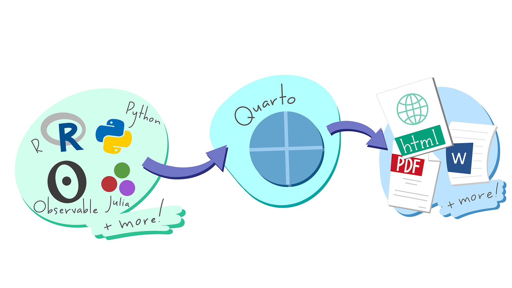
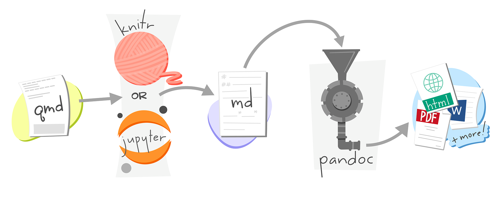
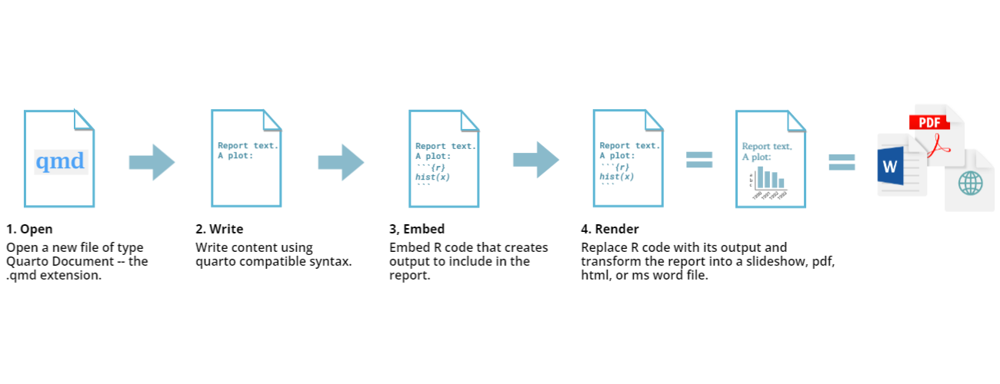
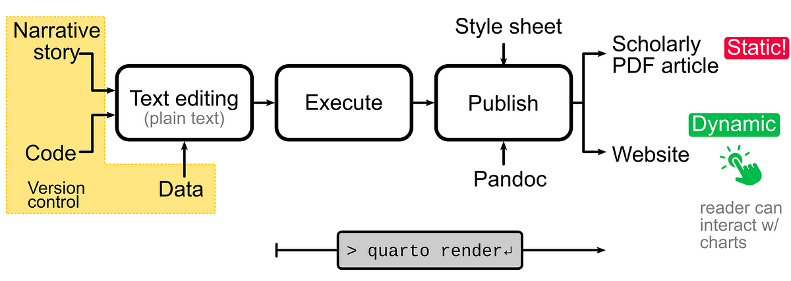

# Documentos Reprodutíveis {#sec-quarto}

 

## Objetivos de aprendizagem

::: {.callout-tip icon="false"}
## \emojitext{🎯} Ao final deste módulo, você será capaz de:

-   Compreender o papel dos documentos dinâmicos no fluxo de trabalho científico reprodutível
-   Entender o funcionamento do Quarto como sistema de publicação científica
-   Reconhecer a integração entre narrativa, código e dados em um documento reprodutível
-   Aplicar o conceito de "reprodutibilidade adequada" através do template ARTE
-   Preparar o ambiente de trabalho (RStudio, Git, Zotero) para criar documentos dinâmicos
-   Explorar o template ARTE em sua versão publicada
-   Utilizar os editores Source e Visual do RStudio para criar e formatar documentos `.qmd`
-   Integrar referências bibliográficas do Zotero diretamente nos documentos Quarto
-   Praticar a transição de um manuscrito Word tradicional para o formato reprodutível Quarto
-   Incorporar códigos de análise (*chunks*) e gerar saídas dinâmicas (tabelas, gráficos)
-   Compilar e publicar o projeto através do GitHub Pages
:::

## Contextualização

A reprodutibilidade e a transparência são princípios fundamentais da Ciência Aberta (CA), independentemente da abordagem metodológica adotada pelo pesquisador [@limongi2025a]. Seja você um pesquisador qualitativo, quantitativo ou misto, as ferramentas e práticas discutidas neste módulo podem ser aplicadas para organizar, documentar e compartilhar seu projeto de pesquisa de forma mais transparente e verificável.

Como discutido nos módulos anteriores, dominar a plataforma [OSF](https://osf.io/), o [Zotero](https://www.zotero.org/) e um protocolo de organização como o [Protocolo TIER](https://www.projecttier.org/tier-protocol/protocol-4-0/) pode ser suficiente para estabelecer um nível básico de reprodutibilidade [@limongi2025b]. A integração dessas soluções com outras ferramentas já utilizadas no dia a dia (armazenamento em nuvens, processadores de texto, softwares específicos de análise) já capacita o pesquisador para ter um projeto organizado e documentado, minimamente, segundo as boas práticas da CA.

Para pesquisadores que preferem interfaces gráficas em vez de programação, existem soluções *no-code* compatíveis com os princípios da CA. Softwares como [JASP](https://jasp-stats.org/) e [Jamovi](https://www.jamovi.org/) oferecem interfaces amigáveis para análises estatísticas, mantendo os outputs salvos junto com os dados, facilitando a reprodutibilidade [@rogers2025]. Adicionalmente, ferramentas como [KNIME](https://www.knime.com/), [Orange](https://orangedatamining.com/) e [OpenRefine](https://openrefine.org/) fornecem ambientes visuais para limpeza, transformação e análise de dados através de workflows baseados em nós, sem exigir programação. Embora essas alternativas ainda apresentem limitações quanto ao controle de versões e à amplitude de análises disponíveis, representam opções válidas, uma porta de entrada, para pesquisadores que buscam aderir aos princípios da CA sem dominar linguagens de programação.

## Quarto: Sistema de Publicação Científica

O foco deste módulo é apresentar o Quarto como ferramenta para criação de documentos dinâmicos reprodutíveis. O [Quarto](https://quarto.org/) é um sistema de publicação científica de código aberto que permite a integração de narrativa, código e resultados em um único documento [@limongi2025b]. Através do Quarto, pesquisadores podem criar documentos com texto, imagens, tabelas, gráficos, equações e referências bibliográficas, com pouca necessidade de programação, especialmente quando utilizado apenas como editor de documentos dinâmicos.

O Quarto é integrado ao RStudio, facilitando sua utilização por pesquisadores já familiarizados com o ambiente R. Entretanto, o Quarto suporta múltiplas linguagens de programação (R, Python, Julia e Observable). No RStudio, os usuários escrevem narrativas e códigos, e o Quarto processa esse conteúdo, exportando o resultado em diferentes formatos como HTML, PDF e DOCX, facilitando a disseminação em múltiplas plataformas.

### Markdown: A Linguagem Base

O Quarto utiliza Markdown como linguagem de marcação para formatação de texto [@limongi2025b]. Markdown é uma sintaxe leve e intuitiva que permite formatar texto de forma simples, utilizando caracteres especiais para indicar títulos, listas, ênfases, links e outros elementos. Por exemplo, `**texto**` produz **texto em negrito**, `## Título` cria um título de segundo nível, e `[link](url)` gera um hiperlink. Esta simplicidade torna o Markdown acessível mesmo para pesquisadores sem experiência em programação.

Neste módulo, não nos aprofundaremos extensivamente na sintaxe Markdown, pois existem recursos excelentes disponíveis. Recomendamos consultar a documentação oficial do Quarto sobre [Markdown Basics](https://quarto.org/docs/authoring/markdown-basics.html) e o [R Markdown Cheat Sheet](https://posit.co/wp-content/uploads/2022/10/rmarkdown-1.pdf) da Posit/RStudio para referência rápida. Durante a aula prática, demonstraremos os elementos mais utilizados na escrita científica, e você poderá consultar esses recursos conforme necessário.

### Arquitetura e Fluxo de Trabalho

As quatro figuras apresentadas a seguir ilustram, em camadas progressivas, como o Quarto organiza e integra texto, código e dados para gerar documentos dinâmicos e reprodutíveis. A sequência é pedagógica: cada figura aprofunda o entendimento do fluxo de trabalho.

A primeira figura (@fig-quarto-illustration) apresenta a visão geral da arquitetura do Quarto. No lado esquerdo, múltiplas linguagens de programação (R, Python, Julia, Observable) podem ser utilizadas como entrada. O Quarto, representado ao centro, atua como plataforma de integração que combina códigos dessas diferentes linguagens para criar documentos ricos em conteúdo. À direita, o sistema pode exportar para diversos formatos de saída (HTML para web, PDF para documentos portáteis, DOCX para edição), oferecendo flexibilidade na distribuição do conteúdo [@limongi2025b].

[{#fig-quarto-illustration}](https://datascience.arizona.edu/events/reproducible-reporting-quarto)

A segunda figura (@fig-quarto-process) detalha o fluxo analítico de processamento. O processo inicia com um arquivo `.qmd` (Quarto Markdown) que contém texto, código e elementos dinâmicos. Este arquivo é processado por ferramentas como knitr (pacote R para integração de código e texto) ou Jupyter (ambiente interativo para múltiplas linguagens), gerando um arquivo Markdown intermediário. Em seguida, o Pandoc, ferramenta poderosa de conversão de documentos, transforma o Markdown nos formatos finais desejados (HTML, PDF, DOCX). Esta camada de processamento garante a conversão adequada do conteúdo dinâmico para formatos estáticos ou interativos.

[{#fig-quarto-process}](https://r-cubed-advanced.rostools.org/sessions/build-website)

A terceira figura (@fig-qmd-workflow) oferece uma visão sintética e didática dos passos práticos. O usuário (1) abre um novo arquivo `.qmd`, (2) escreve o conteúdo usando sintaxe Quarto, (3) incorpora código (por exemplo, R) que gera saídas a serem incluídas no relatório, e (4) renderiza o documento, substituindo o código por suas saídas e gerando o documento final no formato desejado (slides, PDF, HTML ou MS Word). Esta sequência ilustra a simplicidade do workflow para o usuário final.

[{#fig-qmd-workflow}](https://ucsbcarpentry.github.io/Reproducible-Publications-with-RStudio-Quarto/02-quarto/03-quarto-documents/index.html)

Por fim, a quarta figura (@fig-all-workflow) contextualiza o uso do Quarto em uma pesquisa científica empírica completa. A narrativa científica (introdução, metodologia, resultados, discussão), o código de análise e os dados (sob controle de versão para rastreabilidade) são combinados em um editor de texto plano. O código embutido é executado, gerando saídas (gráficos, tabelas, estatísticas) automaticamente incorporadas ao documento. Após aplicação de template e conversão pelo Pandoc, o resultado pode ser um artigo PDF estático para submissão a revistas ou um website dinâmico onde leitores podem interagir com gráficos e visualizações [@rogers2025]. Este fluxo demonstra como o Quarto integra todo o ciclo de produção científica, da concepção à publicação, promovendo transparência e reprodutibilidade.

[{#fig-all-workflow}](https://towardsdatascience.com/technical-writing-and-publishing-data-rich-articles-with-quarto-d61a56bcaa64)

## ARTE: Da Reprodutibilidade Mínima à Adequada

No módulo de organização de projetos, foi apresentado o conceito de "reprodutibilidade mínima", fundamentado na estruturação adequada de pastas (Protocolo TIER), documentação clara (arquivos README) e compartilhamento de materiais em repositórios como o OSF. Esse nível básico garante que dados, scripts e manuscritos estejam organizados logicamente e disponíveis para verificação [@limongi2025b].

O template [ARTE](https://phdpablo.github.io/article-template/) (*Article Reproducibility Template & Environment*) avança para o que denominamos "reprodutibilidade adequada", incorporando ferramentas adicionais que garantem maior rigor e controle [@rogers2025]. O ARTE mantém a estrutura TIER como fundação, mas adiciona:

-   **Controle de versão com Git/GitHub**: rastreamento rigoroso de todas as mudanças no projeto, permitindo retornar a versões anteriores e colaborar de forma transparente
-   **Documentos dinâmicos com Quarto**: integração entre análise e escrita, eliminando erros de cópia manual de resultados
-   **Gerenciamento de dependências com renv**: registro das versões exatas de pacotes utilizados, garantindo que o ambiente computacional possa ser recriado
-   **Integração com Zotero**: gestão automatizada de referências bibliográficas diretamente no fluxo de trabalho

Esta transição representa a evolução de um projeto bem organizado (reprodutibilidade mínima) para um projeto computacionalmente reprodutível (reprodutibilidade adequada), onde outros pesquisadores podem não apenas acessar os materiais, mas também executar as análises e gerar os mesmos resultados [@rogers2025]. O ARTE ainda oferece a opção de "reprodutibilidade completa" através de containerização com Docker, encapsulando todo o ambiente computacional (sistema operacional, versões de software, dependências), mas este nível será explorado no módulo seguinte.

## Preparação para a Aula

::: callout-important
## Pré-requisitos

Para aproveitar ao máximo este módulo, certifique-se de ter completado **todas** as etapas de preparação descritas na seção de [pré-requisitos](https://phdpablo.github.io/curso-open-science/00-prework.html):

\vspace{10pt}

**Checklist de Preparação:**

\vspace{10pt}

1.  \emojitext{✅} **R e RStudio**: Certifique-se de ter o R e o RStudio instalados em seu computador
2.  \emojitext{✅} **Git e GitHub**: Instale o Git em seu computador e crie uma conta no GitHub. Configure a integração do Git/GitHub com o RStudio conforme as instruções do módulo anterior
3.  \emojitext{✅} **Zotero**: Instale o Zotero e o plugin Better BibTeX para gerenciamento de referências bibliográficas
:::
