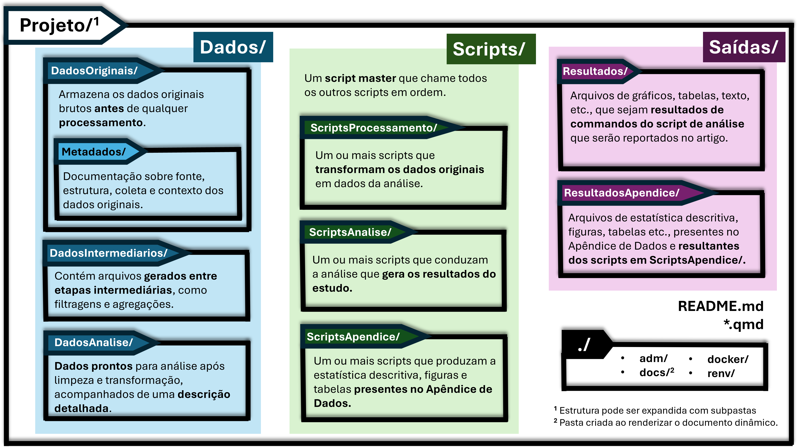
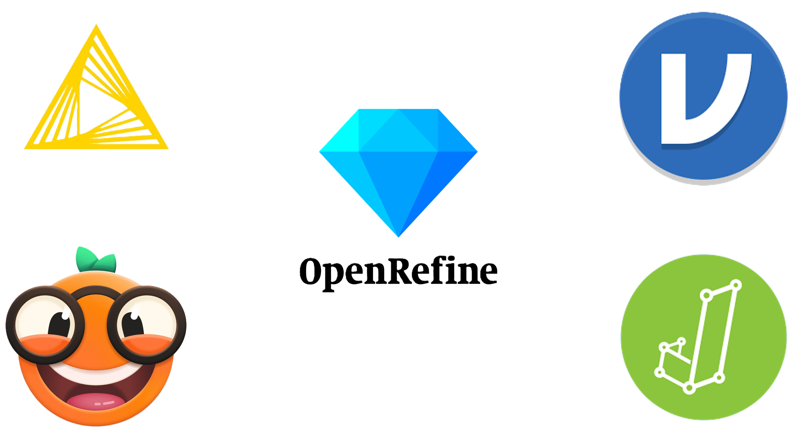

## Objetivo da Aula

<br>

::: incremental
-   📊 Gerenciamento de dados
-   💻 Código e Software
-   🤝 Colaboração
-   📁 Organização de projetos
-   🔄 Acompanhamento de mudanças
-   📝 Redação de manuscritos
-   🎯 Boas práticas complementares
:::

------------------------------------------------------------------------

## Referência Principal

<br>

**Wilson et al. (2017).** Good enough practices in scientific computing. *PLOS Computational Biology*, 13(6), e1005510.\
<a href="https://doi.org/10.1371/journal.pcbi.1005510" target="_blank">https://doi.org/10.1371/journal.pcbi.1005510</a>

<br>

> Esse guia foi adaptado e atualizado para um <a href="https://carpentries-lab.github.io/good-enough-practices/" target="_blank">Curso Carpentries</a> em 2024.

<br>

------------------------------------------------------------------------

## ⚠️ Principais Barreiras à Reprodutibilidade {.smaller}

<br>

::: incremental
**1. Código Ilegível**

-   Sem comentários ou explicações
-   Nomes crípticos de variáveis (`x1`, `temp`, `final2`)

**2. Dependências Não Documentadas**

-   "Funcionou no meu computador" mas pacotes não listados
-   Versões diferentes causam resultados diferentes

**3. Caminhos Absolutos**

-   `C:/Users/Pablo/...` não funciona em outros PCs
-   Quebra portabilidade do código
:::

------------------------------------------------------------------------

## ⚠️ Principais Barreiras (cont.) {.smaller}

<br>

::: incremental
**4. Passos Manuais**

-   "Abra Excel e copie coluna B..." ← NÃO reprodutível!
-   Toda transformação deve estar em SCRIPT

**5. Aleatoriedade Não Controlada**

-   Esquecer `set.seed()` em simulações/bootstraps

**6. Dados Brutos Modificados**

-   Editar dados originais diretamente
-   Perda de rastreabilidade

💡 **Nesta aula vamos aprender a evitar essas barreiras!**
:::

------------------------------------------------------------------------

# 📊 Gerenciamento de Dados {background-color="#F18C22"}

------------------------------------------------------------------------

## Gerenciamento de Dados {.smaller}

<br>

::: incremental
**a. Salve os dados brutos**

-   Nunca sobreescreva os dados originais
-   Use permissões de somente leitura

**b. Backup dos dados brutos**

-   Google Drive, OneDrive, Dropbox
-   **OSF integra com esses serviços:** <a href="https://osf.io/dnrgf/addons/" target="_blank">https://osf.io/dnrgf/addons/</a>

**c. Transformar dados para formatos mais fáceis**

-   CSV, JSON ao invés de Excel
-   Facilita manipulação em R/Python
:::

------------------------------------------------------------------------

## Tidy Data: Os 3 Princípios 🎲

<br>

**Princípios fundamentais:**

::: incremental
1.  **Cada variável = uma coluna**
2.  **Cada observação = uma linha**
3.  **Cada tipo de unidade observacional = uma tabela**
:::

------------------------------------------------------------------------

## Tidy Data: Exemplo Prático {.smaller}

<br>

::::: columns
::: {.column width="50%"}
**❌ Dados "bagunçados" (WIDE):**

| Participante | Jan_2023 | Fev_2023 | Mar_2023 |
|:-------------|:---------|:---------|:---------|
| P001         | 85       | 90       | 88       |
| P002         | 78       | 82       | 85       |

-   Meses são valores, não variáveis!
-   Dificulta análise temporal
-   Complica filtragem/agregação
:::

::: {.column width="50%"}
**✅ Mesmos dados "tidy" (LONG):**

| Participante | Mês      | Score |
|:-------------|:---------|:------|
| P001         | Jan_2023 | 85    |
| P001         | Fev_2023 | 90    |
| P001         | Mar_2023 | 88    |
| P002         | Jan_2023 | 78    |
| P002         | Fev_2023 | 82    |
| P002         | Mar_2023 | 85    |

-   Cada variável em sua coluna
-   Fácil análise em R (dplyr, ggplot2)
-   Escalável para mais observações
:::
:::::

------------------------------------------------------------------------

## Gerenciamento de Dados (cont.) {.smaller}

<br>

::: incremental
**e. Registrar todas as etapas do processamento**

-   Scripts em R/Python documentando cada passo
-   Manter log das operações

**f. Use identificadores únicos**

-   ID único em todas as tabelas
-   **Ver exemplo:** <a href="https://data.mendeley.com/datasets/47vj3yyb5v/1/files/3fdeee55-1d41-4dfd-9066-25566de1df2c" target="_blank">Mendeley Dataset</a>

**g. Disponibilizar dados em repositórios com DOI**

-   OSF, Zenodo, Mendeley Data
-   Facilita citação e reprodutibilidade
:::

------------------------------------------------------------------------

# 💻 Código e Software {background-color="#FFD200"}

------------------------------------------------------------------------

## Código e Software (1/2)

<br>

::::: incremental
::: {.column width="50%"}
**a. Comentários iniciais em scripts**

-   Propósito, autor, data
-   **Exemplo OSF:** <a href="https://osf.io/a6ufw" target="_blank">https://osf.io/a6ufw</a>

**b. Decompor rotinas em funções menores**

-   Modularização facilita manutenção
-   Procure antes de criar!
:::

::: {.column width="50%"}
**c. Evitar duplicação de código**

-   Criar funções reutilizáveis
-   DRY: Don't Repeat Yourself

**d. Buscar e utilizar bibliotecas existentes**

-   Pandas, dplyr, ggplot2...
-   Não reinvente a roda!
:::
:::::

------------------------------------------------------------------------

## Código e Software (2/2) {.smaller}

<br>

::::: incremental
::: {.column width="50%"}
**e. Testar bibliotecas antes de usar**

-   Pequenos testes com seus dados

**f. Dar nomes significativos**

-   Variáveis e funções descritivas
-   **Ver:** <a href="https://data.mendeley.com/datasets/47vj3yyb5v/1/files/3fdeee55-1d41-4dfd-9066-25566de1df2c" target="_blank">Mendeley Dataset</a>
:::

::: {.column width="50%"}
**g. Documentar dependências e requisitos**

-   `requirements.txt` (Python) `renv.lock` (R)
-   No início do código R

**h. Disponibilizar conjuntos de dados de exemplo**

-   Facilita verificação e teste

**i. Enviar código para repositórios com DOI**

-   Zenodo, GitHub
-   **Exemplo:** <a href="https://phdpablo.github.io/article-template/" target="_blank">Article Template</a>
:::
:::::

------------------------------------------------------------------------

## Boas Práticas de Nomenclatura 📝 {.smaller}

<br>

::::::: columns
:::: {.column width="50%"}
**Para Arquivos:**

::: incremental
-   ✅ Use nomes descritivos: `import-survey-data-2024.R`
-   ✅ Use datas no formato ISO: `2024-11-02-analysis.R`
-   ✅ Use números para ordem: `01-import.R`, `02-clean.R`
-   ✅ Evite espaços: use `-` ou `_`
-   ❌ Evite: `final.R`, `new.R`, `data1.csv`, `teste.R`
:::
::::

:::: {.column width="50%"}
**Para Variáveis:**

::: incremental
-   ✅ **snake_case** (R): `participant_age`, `total_income`
-   ✅ Descritivos: `mean_response_time` (não `mrt`)
-   ✅ Evite abreviações crípticas
-   ❌ Evite: `x1`, `temp`, `final2`, `var_new`
:::
::::
:::::::

<br>

------------------------------------------------------------------------

## Tidyverse Style Guide 💡

```{=html}

<iframe src="04-tidyverse_cheatsheet.html" width="100%" height="500" style="border:1px solid #ccc;"></iframe>
```

------------------------------------------------------------------------

# 🤝 Colaboração {background-color="#0D232C"}

------------------------------------------------------------------------

## Colaboração {.smaller}

<br>

::: incremental
**a. Desenvolver um resumo do projeto**

-   Arquivo README.md descritivo
-   **Exemplo:** <a href="https://github.com/phdpablo/article-template/" target="_blank">Repositório ARTE</a>

**b. Manter lista de tarefas acessível**

-   Trello, GitHub Issues
-   **Ver Issues ARTE:** <a href="https://github.com/phdpablo/article-template/issues" target="_blank">https://github.com/phdpablo/article-template/issues</a>

**c. Definir estratégias de comunicação**

-   Canais, reuniões regulares
-   Documentação no OSF: <a href="https://osf.io/dnrgf/" target="_blank">https://osf.io/dnrgf/</a>
:::

------------------------------------------------------------------------

## Colaboração (cont.)

<br>

::: incremental
**d. Especificar claramente a licença**

-   LICENSE.md com Creative Commons ou MIT
-   **Ver:** <a href="https://github.com/phdpablo/article-template" target="_blank">https://github.com/phdpablo/article-template</a>

**e. Tornar o projeto citável**

-   Arquivo CITATION.md
-   **Template:** <a href="https://phdpablo.github.io/article-template/" target="_blank">https://phdpablo.github.io/article-template/</a>
-   **OSF Citation:** <a href="https://osf.io/dnrgf/" target="_blank">https://osf.io/dnrgf/</a>
:::

------------------------------------------------------------------------

# 📁 Organização do Projeto {background-color="#0D232C"}

------------------------------------------------------------------------

## Organização do Projeto {.smaller}

<br>

::::: incremental
::: {.column width="50%"}
**a. Cada projeto em seu próprio diretório**

-   Nome claro e descritivo
-   Tudo relacionado dentro dele

**b. Saídas do projeto no diretório `Output`**

-   Tabelas, gráficos, relatórios, apêndices etc.
:::

::: {.column width="50%"}
**c. Dados brutos e metadata no diretório `Data`**

-   Subdiretórios (mínimo): `InputData/` e `AnalysisData/`

**d. Centralizar rotinas numa pasta de scripts**

-   Diretório `scripts/` e subdiretórios: `AnalysisScripts/`e `ProcessingScripts` (mínimo)

**e. Nomear arquivos para refletir conteúdo**

-   `data_collection.csv` ao invés de `file1.csv`
:::
:::::

------------------------------------------------------------------------

## [Estrutura TIER Protocol 4.0](https://www.projecttier.org/tier-protocol/protocol-4-0/)

[{fig-align="right" width="65%"}](https://phdpablo.github.io/article-template/01-intro.html)

------------------------------------------------------------------------

# 🔄 Acompanhamento de Mudanças {background-color="#87CBCC"}

------------------------------------------------------------------------

## Acompanhamento de Mudanças {.smaller}

::::: incremental
::: {.column width="50%"}
**a. Fazer backup de tudo criado**

-   Dropbox, Google Drive
-   OSF facilita espelhamento!

**b. Manter mudanças pequenas e gerenciáveis**

-   Commits frequentes no Git
-   Pequenas atualizações de cada vez
:::

::: {.column width="50%"}
**c. Compartilhar mudanças regularmente**

-   Sincronização diária
-   Reduz conflitos de merge

**d. Criar checklist para gerenciar mudanças**

-   "Fazer commit", "atualizar README"
-   "Sincronizar repositório"

**e. Usar controle de versão**

-   Git para versionamento
-   GitHub/GitLab para colaboração
-   Histórico completo de mudanças
:::
:::::

------------------------------------------------------------------------

# 📝 Manuscritos {background-color="#FFD200"}

------------------------------------------------------------------------

## Manuscritos

<br>

::::: incremental
::: {.column width="50%"}
**a. Ferramentas online com controle de versão**

-   Google Docs, Microsoft OneDrive
-   Histórico de versões automático
-   Facilita colaboração em tempo real
:::

::: {.column width="50%"}
**b. Formato de texto simples com controle de versão**

-   LaTeX, Markdown, **Quarto**
-   Ideal para versionamento no Git
-   **Exemplo:** [ARTE](https://phdpablo.github.io/article-template/)
:::
:::::

------------------------------------------------------------------------

# 🎯 Boas Práticas Complementares {background-color="#0D232C"}

------------------------------------------------------------------------

## Práticas para Reprodutibilidade Mínima

<br>

Se você **não** vai usar o RStudio/Quarto ou Git/GitHub, considere, **no mínimo**, essas dicas:

::: incremental
1.  🎬 **Master Script** - Automação completa do pipeline
2.  🗺️ **Caminhos Relativos** - Portabilidade de código
3.  📝 **Documentação de Ambiente** - Versões de software/pacotes
4.  🔧 **Soluções "nocode"** - Ferramentas sem código
5.  📊 **Organização no Excel** - Boas práticas em planilhas
:::

------------------------------------------------------------------------

## 1️⃣ Master Script {.smaller}

<br>

**O que é:** Um único script que executa todo o projeto do início ao fim

**Por que importa:** Elimina ambiguidade sobre ordem de execução

**Exemplo de como fazer:**

``` r
# run_all.R - Master Script
rm(list = ls())                    # Limpa ambiente
unlink("results/*")                # Remove outputs antigos

source("src/00-setup.R")           # Carrega pacotes
source("src/01-import-data.R")     # Importa dados
source("src/02-clean-data.R")      # Limpa dados
source("src/03-analyze.R")         # Análises
source("src/04-generate-plots.R")  # Gráficos

rmarkdown::render("doc/paper.Rmd") # Compila manuscrito
cat("✅ Pipeline completo!
")
```

------------------------------------------------------------------------

## 2️⃣ Caminhos Relativos {.smaller}

<br>

**O problema:** Caminhos absolutos não funcionam em outros computadores

``` r
# ❌ Não portável
data <- read.csv("C:/Users/Pablo/meu_projeto/data/dados.csv")
```

**A solução:** Use pacote `here` para caminhos relativos

``` r
# ✅ Portável - funciona em qualquer PC
library(here)
data <- read.csv(here("data", "raw", "dados.csv"))
write.csv(results, here("results", "output.csv"))
```

**Regras de ouro:**

-   NUNCA use `setwd()` em scripts
-   **Use RStudio Projects (.Rproj)**
-   Se não usa o RStudio, utilize `here::here()` para construir paths

------------------------------------------------------------------------

## 3️⃣ Documentação de Ambiente {.smaller}

<br>

**O problema:** Código que funcionava em 2023 pode quebrar em 2025 devido a mudanças em pacotes

**Solução mínima:**

-   Informe as versões dos softwares e pacotes
-   Adicione `sessionInfo()` ao final de cada script

``` r
# No final do seu script
sessionInfo()

# Salvar em arquivo
sink(here("results", "session_info.txt"))
sessionInfo()
sink()
```

**Solução avançada:** Use `renv` para isolar ambientes por projeto

``` r
renv::init()      # Inicializa renv (uma vez)
renv::snapshot()  # "Fotografa" versões atuais
renv::restore()   # Restaura ambiente idêntico
```

------------------------------------------------------------------------

## 3️⃣ Documentação de Ambiente

::: incremental
**Adicionar arquivo CHANGELOG.txt**

-   Log com data e descrição
-   Controle manual de versão
-   No Git: histórico fica nos commits

**Copiar projeto em mudanças significativas**

-   Snapshots datados
-   Segurança adicional
:::

------------------------------------------------------------------------

## 4️⃣ Soluções "nocode"

{fig-align="center"}

------------------------------------------------------------------------

## 5️⃣ Se persistir ficar no Excel... {.smaller}

:::: {.column width="30%"}
::: incremental
1.  Priorize legibilidade por máquinas
2.  Cabeçalhos simples e padronizados
3.  Uma informação por célula
4.  Mantenha consistência
5.  Padronize valores ausentes
6.  Use formato ISO 8601 para datas
7.  Proteja dados brutos
8.  Organize arquivos por etapas
9.  Documente com metadados
10. Prefira formatos abertos
:::
::::

::: {.column width="70%"}
[{fig-align="center" width="75%"}](https://doi.org/10.1371/journal.pcbi.1012604)
:::

------------------------------------------------------------------------

## Mensagem Final 💬

> **"Seu principal colaborador é você mesmo daqui 6 meses,**\
> **que não vai lembrar de nada do que fez hoje."**
>
> --- Adaptado de Karl Broman

::: incremental
-   Reprodutibilidade não é sobre ser perfeito 🎯
-   É sobre tornar a ciência **um pouco melhor** a cada dia 📈
-   **Projeto 80% reprodutível é MUITO melhor que 0%!** 🌟
-   Comece pequeno, melhore gradualmente 🌱
-   **Seus colaboradores (e seu eu-futuro) vão agradecer!** 🙏
:::
