## Objetivos da Aula

 

::: incremental
-   🔄 Compreender controle de versão para Ciência Aberta
-   🔧 Distinguir Git (local) de GitHub (remoto/colaborativo)
-   ⚠️ Reconhecer limitações de ferramentas simples de versionamento
-   🌿 Identificar workflows apropriados para pesquisa
-   💻 Configurar e usar Git/GitHub integrado ao RStudio
-   📊 Realizar operações básicas: commit, push, pull, branch
:::

::: notes
Esta aula conecta-se diretamente com o módulo anterior de organização de
projetos (ARTE template). Agora vamos adicionar a camada de controle de
versão para tornar projetos verdadeiramente reprodutíveis e rastreáveis.
Foco será em RStudio GUI, minimizando comandos de terminal.
:::

------------------------------------------------------------------------

## O Problema do Versionamento Amador

{fig-align="center" width="70%"}

::: notes
Fonte: https://phdcomics.com/comics/archive.php?comicid=1531

Esta situação cômica ilustra o caos de não ter controle de versão
adequado. Todos os pesquisadores já passaram por isso. Git resolve esse
problema criando histórico estruturado e rastreável de todas as
mudanças, sem necessidade de múltiplos arquivos com nomes que somente
você consegue decifrar!.
:::

------------------------------------------------------------------------

## Preliminares: Alternativas ao Git {.smaller}

 

::: incremental
**Existem outras soluções de controle de versão:**

-   CVS, Subversion (SVN), Monotone, BitKeeper, Perforce

**Por que Git?**

-   **Global Information Tracker (GIT)** - mesmo criador do Linux (Linus
    Torvalds, 2005)
-   Modelo de branching superior e eficiente
-   Distribuído: funciona localmente sem necessidade de servidor
-   Comunidade massiva e ferramentas integradas (GitHub, GitLab)

**GitHub específico:**

-   Desenvolvido em 2008, atualmente pertence à Microsoft
-   Plataforma de hospedagem + colaboração baseada em Git
:::

::: notes
Contextualizar que Git não é a única opção, mas é a mais amplamente
adotada na ciência e desenvolvimento de software. A combinação Git +
GitHub tornou-se padrão para pesquisa reprodutível. Enfatizar que Git
funciona localmente (privacidade) e GitHub adiciona colaboração e
visibilidade pública.
:::

------------------------------------------------------------------------

## Git vs GitHub: Conceitos Fundamentais

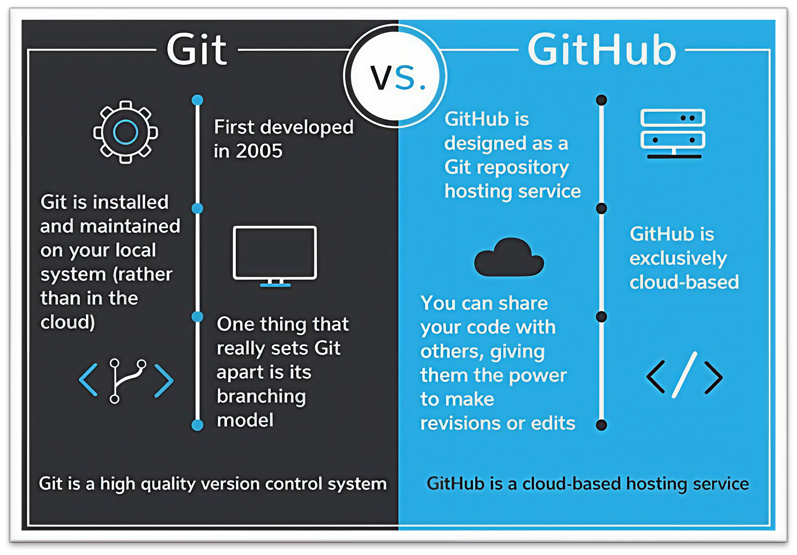{fig-align="center" width="65%"}

::: notes
Git é o sistema de controle de versão instalado localmente. Pense nele
como "banco de dados de versões" no seu computador. GitHub é serviço na
nuvem que hospeda repositórios Git e adiciona ferramentas de colaboração
(pull requests, issues, actions). Git = local e privado. GitHub = remoto
e (opcionalmente) público. Você pode usar Git sem GitHub, mas GitHub
requer Git.
:::

------------------------------------------------------------------------

## Controle de Versão Local (Git)

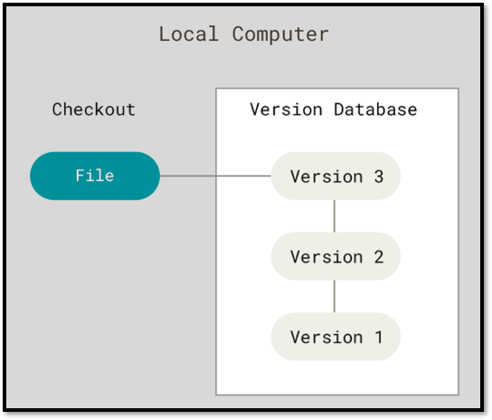{fig-align="center" width="60%"}

::: notes
Fonte: https://git-scm.com/book/en/v2

Diagrama mostra funcionamento local do Git. Version Database no
computador armazena histórico completo (Version 1, 2, 3...). Checkout
permite voltar a qualquer versão anterior. Tudo acontece localmente -
não precisa de internet. Ideal para pesquisadores que querem privacidade
durante desenvolvimento.
:::

------------------------------------------------------------------------

## Anatomia do Workflow Git Local

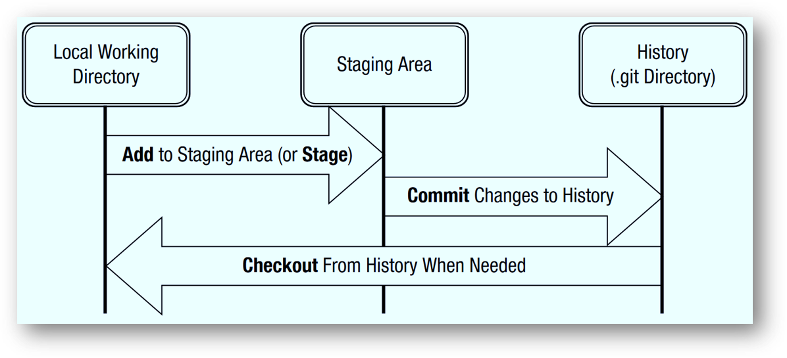{fig-align="center" width="60%"}

::: notes
DOI: 10.1177/2515245918754826 (Vuorre & Curley, 2018)

Três áreas fundamentais: 1. Working Directory (arquivos que você edita)
2. Staging Area (área intermediária - arquivos prontos para commit) 3.
History/.git Directory (histórico permanente)

Workflow: Edit → Stage (git add) → Commit (salvar snapshot) → Checkout
(recuperar versão antiga se necessário). RStudio GUI implementa
exatamente esse fluxo com botões visuais.
:::

------------------------------------------------------------------------

## Controle de Versão Distribuído

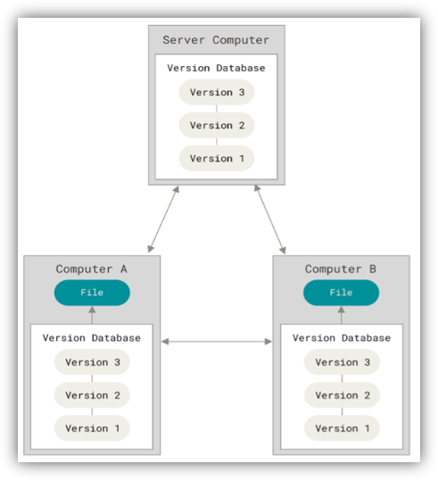{fig-align="center" width="70%"}

::: notes
Fonte: https://git-scm.com/book/en/v2

Sistema distribuído: cada computador (A, B, Server) tem cópia completa
do histórico. Não há "servidor central" obrigatório. Se um computador
falhar, qualquer outro pode restaurar projeto completo. Server Computer
pode ser GitHub, mas é apenas mais uma cópia. Modelo robusto e
resiliente.
:::

------------------------------------------------------------------------

## Git + GitHub: Sincronização

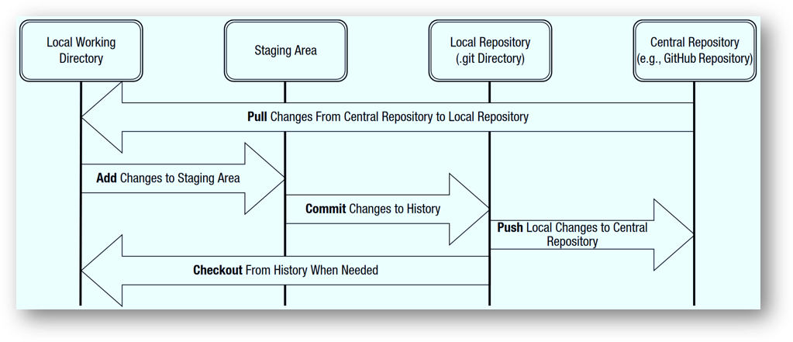{fig-align="center" width="60%"}

::: notes
DOI: 10.1177/2515245918754826

Adiciona camada remota ao workflow local. Central Repository (GitHub)
sincroniza com Local Repository via: - Pull: baixar mudanças do GitHub
para local - Push: enviar commits locais para GitHub

Staging e Commit continuam locais. GitHub só recebe quando você faz
Push. Permite trabalhar offline e sincronizar quando conveniente.
:::

------------------------------------------------------------------------

## Comandos Git Essenciais e RStudio GUI {.smaller}

::: incremental
**Comandos que o RStudio GUI substitui:**

-   `git add` → Checkbox "Staged" no Git pane
-   `git commit` → Botão "Commit" + mensagem
-   `git push` → Botão verde "Push" (⬆️)
-   `git pull` → Botão azul "Pull" (⬇️)
-   `git status` → Coluna "Status" (M, A, D, ?)
-   `git diff` → Botão "Diff"
-   `git log` → Botão "History" (🕐)
:::

::: notes
Fonte:
https://techcommunity.microsoft.com/t5/educator-developer-blog/introduction-to-git-github-and-version-control-workshop-o-matic/ba-p/3951511

Demonstrar equivalência entre comandos shell e RStudio GUI. Na aula
prática, alunos usarão exclusivamente interface gráfica, exceto
configuração inicial (git config via terminal). Enfatizar que GUI é tão
poderoso quanto linha de comando para workflow diário.
:::

------------------------------------------------------------------------

## Workflow Colaborativo Completo

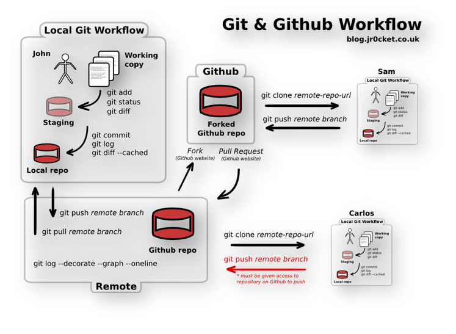{fig-align="center"
width="75%"}

::: notes
Fonte:
https://jr0cket.co.uk/2013/08/getting-to-grips-with-git-understanding-the-simple-workflow.html

Diagrama mostra três colaboradores (John, Sam, Carlos) trabalhando no
mesmo projeto GitHub. Cada um tem Working copy → Staging → Local repo.
Fork e Pull Request são mecanismos GitHub para colaboração estruturada.
Para nosso público, workflow será mais simples: clone → edit → commit →
push (sem fork). Branches virão depois.
:::

------------------------------------------------------------------------

## Pensando em Linha do Tempo: Branches

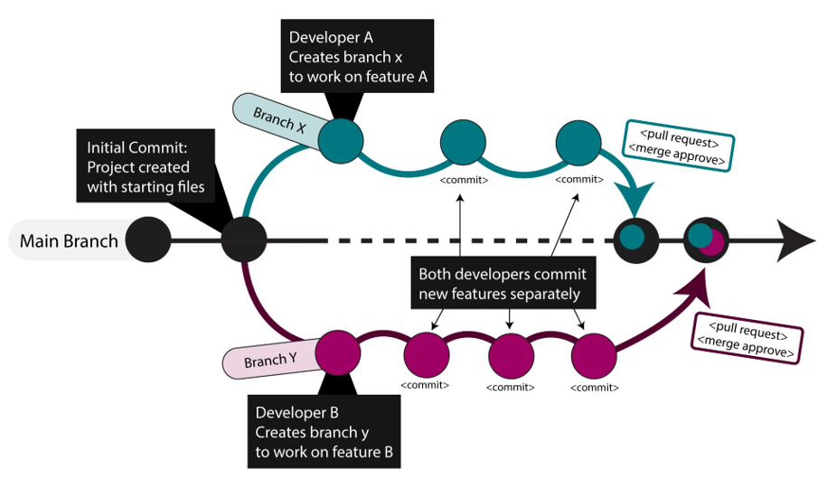{width="30%"}

::: notes
Fonte:
https://kevinsguides.com/guides/code/devops/file-mgmt/git-github-workflow-branch-merge

Initial Commit cria Main Branch. Desenvolvedores A e B criam branches (X
e Y) para trabalhar em features separadamente. Commits acontecem
paralelamente. Pull requests são abertos e merge approve integra
branches de volta ao Main. Branches permitem experimentação sem afetar
código principal.
:::

------------------------------------------------------------------------

## Estratégias de Branching: Visão Geral

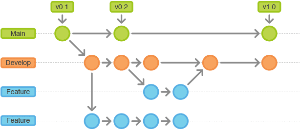{width="30%"}

::: notes
Fonte: https://buddy.works/blog/5-types-of-git-workflows

MASTER (ou main) é branch principal. DEVELOP para desenvolvimento
contínuo. FEATURE branches para funcionalidades específicas. Existem
várias estratégias (GitFlow, GitHub Flow, Trunk-Based). Para iniciantes
em pesquisa, workflow mais simples é suficiente: trabalhar direto no
main ou criar branch temporário para experimento.
:::

------------------------------------------------------------------------

## GitFlow: Estratégia Avançada {.smaller}

   

::: {.column width="60%"}
{fig-align="center" width="65%"}
:::

:::: {.column width="40%"}
::: incremental
**Branches especializados:**

-   **Main**: versão de produção estável
-   **Develop**: desenvolvimento contínuo
-   **Feature**: funcionalidades específicas
-   **Release**: preparação para lançamento (v0.1, v0.2, v1.0)
-   **Hotfix**: correções urgentes em produção
:::
::::

::: notes
Fonte:
https://medium.com/devsondevs/gitflow-workflow-continuous-integration-continuous-delivery-7f4643abb64f

GitFlow é estratégia complexa para projetos grandes de software. Para
pesquisadores, é excessivo na maioria dos casos. Mostrar apenas para
contextualizar que existem workflows avançados, mas não focaremos nisso.
Pesquisa reprodutível funciona bem com estratégias mais simples.
:::

------------------------------------------------------------------------

## Workflow Colaborativo: 3 Autores

 

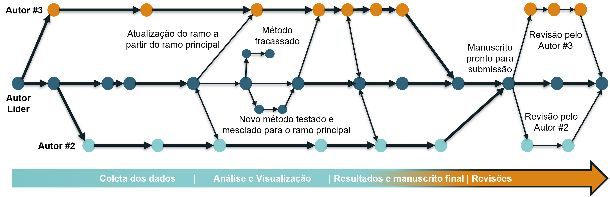{fig-align="center" width="70%"}

::: notes
DOI: 10.5281/zenodo.12521133

Fluxo de trabalho hipotético para colaboração científica com 3 autores.
Cada círculo = commit (cores = autores diferentes). Setas bidirecionais
= sincronização (push/pull). Setas unidirecionais = atualização de
branch. Autor Líder coordena. Autores #2 e #3 trabalham em branches
separados e fazem revisão mútua. Método fracassado é descartado. Novo
método testado e mesclado. Manuscrito pronto após revisões. Workflow Git
Workflow Simplificado com revisão por pares estruturada.
:::

------------------------------------------------------------------------

## Workflow Solo: Sincronização Inicial

 

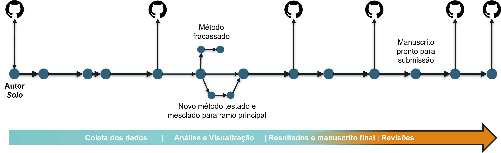{fig-align="center" width="70%"}

::: notes
DOI: 10.5281/zenodo.12521133

Pesquisa solo com sincronização desde etapas iniciais. Autor faz commits
locais e sincroniza (push/pull) frequentemente com GitHub remoto.
Repositório remoto funciona como backup e (se público) permite
acompanhamento da evolução do trabalho. Trunk-Based Development:
trabalho direto no main, branches temporários para experimentos. Método
fracassado descartado, novo método integrado. Adequado para
pesquisadores que valorizam transparência desde o início.
:::

------------------------------------------------------------------------

## Workflow Solo: Sincronização Final

 

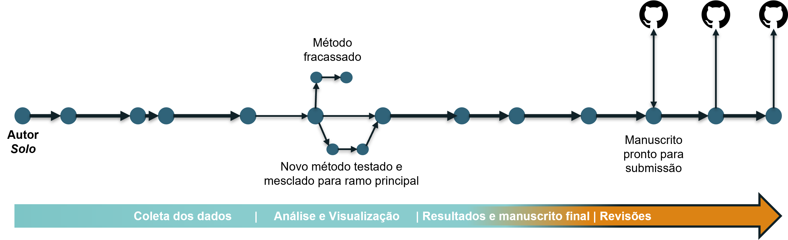{fig-align="center" width="70%"}

::: notes
DOI: 10.5281/zenodo.12521133

Alternativa: pesquisador trabalha localmente (Git) durante todo
desenvolvimento. Somente quando manuscrito está pronto para submissão,
sincroniza com GitHub remoto público. Vantagem: privacidade durante
exploração/experimentação. Desvantagem: GitHub não serve como backup
durante desenvolvimento (mas pode usar OneDrive/Google Drive). Adequado
para pesquisadores que preferem tornar trabalho público apenas quando
finalizado. Ambos workflows (início vs. final) são válidos - depende de
preferência e política da área.
:::

------------------------------------------------------------------------

## Por Que Ferramentas Simples Não Bastam? {.smaller}

 

::::: incremental
::: {.column width="50%"}
**Limitações de processadores de texto e nuvem:**

-   ❌ Histórico de versões limitado e pouco detalhado
-   ❌ Dificulta colaboração com múltiplos autores
-   ❌ Não otimizado para código e dados científicos
-   ❌ Impossibilita automação de testes e validações
-   ❌ Sem mecanismos de resolução de conflitos eficientes
-   ❌ Documentação informal e não estruturada
:::

::: {.column width="50%"}
**Vantagens do Git/GitHub:**

-   ✅ Rastreamento minucioso (autor + propósito de cada mudança)
-   ✅ Branches e merge estruturados para colaboração
-   ✅ Automação via GitHub Actions (CI/CD)
-   ✅ Commit messages e issues para documentação
:::
:::::

::: notes
Vuorre & Curley (2018) e Gilroy et al. (2019) demonstram empiricamente
que Git/GitHub superam ferramentas simples para pesquisa reprodutível.
Controles de versão do Word/Google Docs são adequados para rascunhos de
texto, mas inadequados para gerenciar projetos de pesquisa completos
(dados + código + manuscrito + figuras). Git oferece proveniência
completa e auditável.
:::

------------------------------------------------------------------------

## Na Prática: RStudio + Git + GitHub {.smaller}

 

::: incremental
**Workflow que aprenderemos hoje:**

1.  ⚙️ Configurar Git e SSH keys (uma vez)
2.  🌐 Criar repositório no GitHub
3.  📥 Clonar repositório no RStudio
4.  📝 Editar arquivos localmente
5.  ✅ Stage → Commit com mensagem clara
6.  ⬇️ Pull (sempre antes de push!)
7.  ⬆️ Push para GitHub
8.  🔄 Repetir ciclo 4-7 continuamente
:::

::: notes
Este é o workflow essencial que percorreremos na parte prática.
Começamos do GitHub (GitHub-first workflow) porque é mais simples que
inicializar localmente e conectar depois. RStudio GUI cobre 100% desse
workflow sem necessidade de terminal (exceto git config inicial). Foco
em hábitos: pull antes push, commits frequentes, mensagens descritivas,
.gitignore para dados sensíveis.
:::

------------------------------------------------------------------------

## Preparação para Próximo Módulo {.smaller}

 

::::: incremental
::: {.column width="50%"}
**Conexão com GitHub Pages:**

-   📄 Repositório público é **obrigatório** para GitHub Pages gratuito
-   🌿 Publishing source: branch `main` (ou outra configurada)
-   🌐 URL resultante: `https://usuario.github.io/nome-repo`
-   🚀 Workflow: render Quarto → commit HTML → push → site online em
    minutos
:::

::: {.column width="50%"}
**Conceitos introduzidos hoje:**

-   Navegação interface GitHub (Code, Settings, History)
-   Público vs Privado (implicações)
-   Publishing source (preparação conceitual)
:::
:::::

::: notes
Bloco 5 do roteiro: preparar terreno para módulo de documentos dinâmicos
(Quarto + GitHub Pages). Alunos já entenderão "onde site será publicado"
e "como configurar". Próxima aula focará exclusivamente em Quarto, sem
sobrecarga de conceitos Git/GitHub. Separação didática eficiente.
:::
